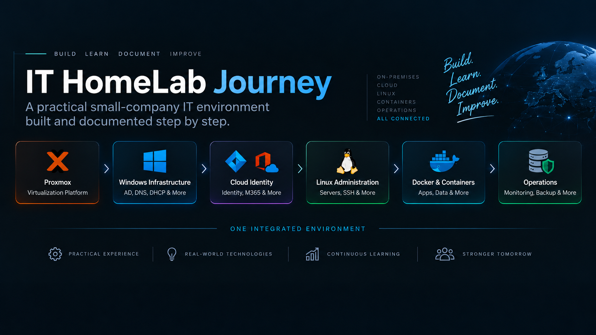
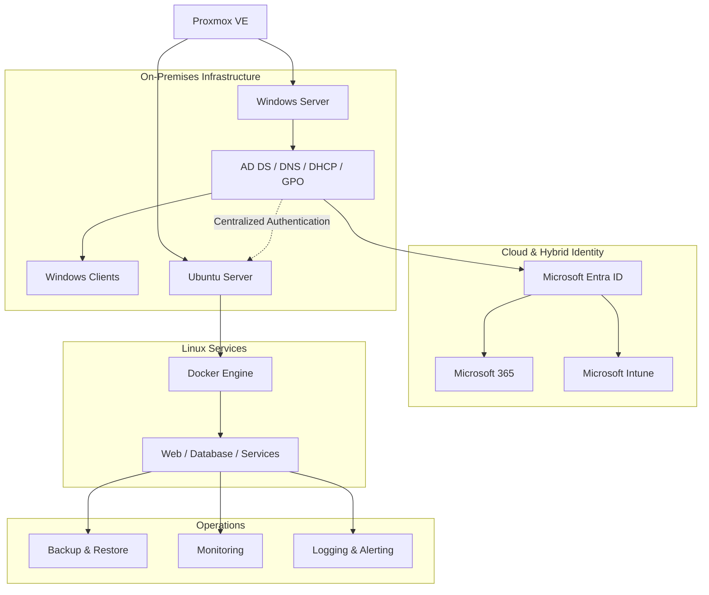

# IT HomeLab Journey

> A practical HomeLab project where I build, test, and document a small-company IT environment step by step.

  

In this project, I use the HomeLab to practice and improve my system administration skills while working with **Windows infrastructure, Microsoft cloud services, Linux administration, containers, networking, backup, monitoring, and security**.

My goal is not to create many separate labs. Instead, I am building **one connected IT environment** where the different technologies work together.

Each repository represents one part of this environment.

---

## Project at a Glance

| Part | Focus | Status | Repository |
|---|---|:---:|---|
| **Part 1** | Windows Infrastructure | ✅ Completed | [IT-HomeLab-Windows-Infrastructure](https://github.com/ali-turkoglu/IT-HomeLab-Windows-Infrastructure) |
| **Part 2** | Cloud Identity & Microsoft 365 | ✅ Completed | [IT-HomeLab-Cloud-Identity](https://github.com/ali-turkoglu/IT-HomeLab-Cloud-Identity) |
| **Part 3** | Linux Administration | 🚧 In Progress | [IT-HomeLab-Linux-Administration](https://github.com/ali-turkoglu/IT-HomeLab-Linux-Administration) |
| **Part 4** | Docker & Containers | ⏳ Planned | Planned |
| **Part 5** | Linux Operations | ⏳ Planned | Planned |

> **Current Focus:** Part 3 – Linux Administration / Phase 6 – Processes, Logs & Troubleshooting

---

## Architecture

The HomeLab combines on-premises systems, cloud services, Linux, and containers.

The long-term goal is to make these parts work together like a small company IT environment.

---

## Portfolio Highlights

So far, I have worked with:

- **Proxmox VE** for virtualization
- **Windows Server and Active Directory**
- **DNS, DHCP, and Group Policy**
- **Windows File Services, Print Server, and WSUS**
- **Windows Server Backup and Veeam Backup & Replication**
- **Microsoft Entra ID and Hybrid Identity**
- **Microsoft Entra Connect and Cloud Sync**
- **Microsoft 365, Exchange Online, SharePoint, and OneDrive**
- **Microsoft Intune and endpoint management**
- **Ubuntu Server administration**
- **Linux users, groups, permissions, and storage**
- **SSH key-based remote administration**
- **Linux package and service management**
- **Linux processes, logs, and troubleshooting**

Planned topics include **WireGuard VPN, Active Directory integration for Linux, Docker, monitoring, backup validation, and Linux operations**.

---

## Technologies

### Currently Implemented

| Area | Technologies |
|---|---|
| Virtualization | Proxmox VE |
| Windows Infrastructure | Windows Server, Active Directory |
| Network Services | DNS, DHCP |
| Windows Management | Group Policy, WSUS |
| Backup | Windows Server Backup, Veeam Backup & Replication |
| Cloud Identity | Microsoft Entra ID, Entra Connect, Cloud Sync |
| Cloud Services | Microsoft 365, Exchange Online, SharePoint, OneDrive |
| Endpoint Management | Microsoft Intune |
| Linux | Ubuntu Server, SSH, APT, dpkg, systemd |
| Automation | PowerShell, Bash |
| Version Control | Git, GitHub |

### Planned

WireGuard · Docker · Docker Compose · Portainer · Monitoring · Alerting

---

## Part 1 – Windows Infrastructure

> **Building the on-premises foundation**
> 
> Repository: [IT-HomeLab-Windows-Infrastructure](https://github.com/ali-turkoglu/IT-HomeLab-Windows-Infrastructure)

In the first part, I built the main on-premises infrastructure of the HomeLab.

I started with Proxmox VE and then added Windows Server, Active Directory, DNS, DHCP, Group Policy, file services, backup, and update management.

This environment became the base for the later cloud and Linux projects.

### ✅ Phase 1 – [Hardware Selection & Procurement](https://github.com/ali-turkoglu/IT-HomeLab-Windows-Infrastructure/blob/main/docs/1-Hardware/README.md)
I selected a low-cost Mini PC that could run several virtual machines and support the planned HomeLab environment.

### ✅ Phase 2 – [Proxmox VE Installation](https://github.com/ali-turkoglu/IT-HomeLab-Windows-Infrastructure/blob/main/docs/2-Proxmox/README.md)
I installed Proxmox VE and prepared the main virtualization platform for my Windows and Linux virtual machines.

### ✅ Phase 3 – [Proxmox Post-Installation Configuration](https://github.com/ali-turkoglu/IT-HomeLab-Windows-Infrastructure/blob/main/docs/3-Proxmox-Configuration/README.md)
After the installation, I completed the basic Proxmox configuration and prepared the host for stable VM operation.

### ✅ Phase 4 – [Windows Server Installation](https://github.com/ali-turkoglu/IT-HomeLab-Windows-Infrastructure/blob/main/docs/4-Windows-Server-Installation/README.md)
I deployed Windows Server as the main server system for the on-premises infrastructure.

### ✅ Phase 5 – [Windows Server Initial Configuration](https://github.com/ali-turkoglu/IT-HomeLab-Windows-Infrastructure/blob/main/docs/5-Windows-Server-Initial-Configuration/README.md)
I configured the server name, network settings, updates, and other basic settings before installing server roles.

### ✅ Phase 6 – [Active Directory Domain Services](https://github.com/ali-turkoglu/IT-HomeLab-Windows-Infrastructure/blob/main/docs/6-Active-Directory-Domain-Services/README.md)
I installed Active Directory Domain Services and created the **homelab.local** domain. The server became the central identity and authentication system of the HomeLab.

### ✅ Phase 7 – [DNS & DHCP](https://github.com/ali-turkoglu/IT-HomeLab-Windows-Infrastructure/blob/main/docs/7-DNS-DHCP/README.md)
I configured DNS and DHCP to provide central name resolution and IP address management for the network.

### ✅ Phase 8 – [Domain Client & Group Policy](https://github.com/ali-turkoglu/IT-HomeLab-Windows-Infrastructure/blob/main/docs/8-Domain-Client&Group-Policy/README.md)
I joined Windows clients to the domain and used Group Policy to manage client settings centrally.

### ✅ Phase 9 – [Active Directory Organization & File Sharing](https://github.com/ali-turkoglu/IT-HomeLab-Windows-Infrastructure/blob/main/docs/9-Active-Directory-Organization&Security-File-Sharing/README.md)
I created an OU structure for users and computers and configured shared folders with controlled access permissions.

### ✅ Phase 9b – [Secure File Transfer with FTPS](https://github.com/ali-turkoglu/IT-HomeLab-Windows-Infrastructure/blob/main/docs/9B-FTPS-Secure-File-Transfer/README.md)
I added an FTPS service with TLS encryption, Active Directory access control, and secure remote access through WireGuard.

### ✅ Phase 10 – [Print Server Configuration](https://github.com/ali-turkoglu/IT-HomeLab-Windows-Infrastructure/blob/main/docs/10–Print-Server-Configuration/README.md)
I configured a Windows Print Server to manage a network printer centrally.

### ✅ Phase 11a – [Windows Server Backup](https://github.com/ali-turkoglu/IT-HomeLab-Windows-Infrastructure/blob/main/docs/11-Windows-Backup-Server/README.md)
I used Windows Server Backup to learn the basic backup process and protect server data.

### ✅ Phase 11b – [Veeam Backup & Replication](https://github.com/ali-turkoglu/IT-HomeLab-Windows-Infrastructure/blob/main/docs/11b-Veeam-Backup&Replication/README.md)
I deployed Veeam Backup & Replication Community Edition and created a dedicated backup server for the HomeLab virtual machines.

### ✅ Phase 12 – [Windows Server Update Services](https://github.com/ali-turkoglu/IT-HomeLab-Windows-Infrastructure/blob/main/docs/12-WSUS/README.md)
I installed and configured WSUS to manage Windows updates centrally.

---

## Part 2 – Cloud Identity & Microsoft 365

> **Extending the HomeLab into the cloud**
> 
> Repository: [IT-HomeLab-Cloud-Identity](https://github.com/ali-turkoglu/IT-HomeLab-Cloud-Identity)

In the second part, I connected the local Windows environment with Microsoft cloud services.

The main goal was to understand how local Active Directory, Microsoft Entra ID, Microsoft 365, and Windows devices can work together in a hybrid environment.

### ✅ Phase 13 – [Cloud Environment Preparation](https://github.com/ali-turkoglu/IT-HomeLab-Cloud-Identity/blob/main/docs/13-Cloud-Environment-Preparation/README.md)
I prepared the Microsoft 365 tenant, administrative accounts, licenses, and basic cloud settings for the next phases.

### ✅ Phase 14 – [Microsoft Entra ID Fundamentals](https://github.com/ali-turkoglu/IT-HomeLab-Cloud-Identity/blob/main/docs/14-Microsoft-Entra-ID-Fundamentals/README.md)
I worked with Microsoft Entra ID users, groups, roles, and basic identity-management concepts.

### ✅ Phase 15 – [Microsoft Entra ID Security](https://github.com/ali-turkoglu/IT-HomeLab-Cloud-Identity/blob/main/docs/15-Microsoft-Entra-ID-Security/README.md)
I added basic identity-security controls, including MFA and an emergency administrative account.

### ✅ Phase 16 – [Microsoft Entra ID Connect Cloud Sync](https://github.com/ali-turkoglu/IT-HomeLab-Cloud-Identity/blob/main/docs/16-Microsoft-Entra-ID-Connect-Cloud-Sync/README.md)
I installed the Microsoft Entra Provisioning Agent and synchronized Active Directory users to Microsoft Entra ID with Password Hash Synchronization.

### ✅ Phase 17 – [Exchange Online Administration](https://github.com/ali-turkoglu/IT-HomeLab-Cloud-Identity/blob/main/docs/17-Exchange-Online-Administration/README.md)
I worked with Exchange Online and tested cloud-based email administration inside the Microsoft 365 environment.

### ✅ Phase 18 – [Cloud File Services](https://github.com/ali-turkoglu/IT-HomeLab-Cloud-Identity/blob/main/docs/18–Cloud-File-Services/README.md)
I used SharePoint and OneDrive for document libraries, permissions, versioning, and secure file sharing.

### ✅ Phase 19 – [Microsoft Entra Connect & Hybrid Device Synchronization](https://github.com/ali-turkoglu/IT-HomeLab-Cloud-Identity/blob/main/docs/19–Entra-Connect-Hybrid-Device-Sync/README.md)
I installed Microsoft Entra Connect, configured OU filtering, and connected domain Windows clients to Microsoft Entra ID with Hybrid Join.

### ✅ Phase 20 – [Microsoft Intune & Endpoint Management](https://github.com/ali-turkoglu/IT-HomeLab-Cloud-Identity/blob/main/docs/20–Microsoft-Intune-Endpoint-Management/README.md)
I added Microsoft Intune to the environment and worked with cloud-based Windows device management and policies.

---

## Part 3 – Linux Administration

> **Build & Administer**
> 
> Repository: [IT-HomeLab-Linux-Administration](https://github.com/ali-turkoglu/IT-HomeLab-Linux-Administration)

In the third part, I added Ubuntu Server to the existing HomeLab.

My goal is to build a Linux server that is not isolated from the rest of the environment.

Later, this server will become an **Active Directory member, Docker host, secure remote-access system, and Linux operations platform**.

### ✅ Phase 1 – [Ubuntu Server Installation & Base Configuration](https://github.com/ali-turkoglu/IT-HomeLab-Linux-Administration/blob/main/docs/1-Ubuntu-Server-Installation-Base-Configuration/README.md)
I installed Ubuntu Server on Proxmox and configured the hostname, static IP address, DNS, timezone, updates, and QEMU Guest Agent.

### ✅ Phase 2 – [Linux Users, Groups & Permissions](https://github.com/ali-turkoglu/IT-HomeLab-Linux-Administration/blob/main/docs/2-Linux-Users-Groups-Permissions/README.md)
I created local users and groups and practiced ownership, permissions, shared directories, sudo access, and least privilege.

### ✅ Phase 3 – [Linux Filesystem & Storage Basics](https://github.com/ali-turkoglu/IT-HomeLab-Linux-Administration/blob/main/docs/3-Linux-Filesystem-Storage-Basics/README.md)
I learned the Linux filesystem structure and worked with disks, filesystems, mounts, storage usage, and basic storage management.

### ✅ Phase 4 – [SSH & Remote Administration](https://github.com/ali-turkoglu/IT-HomeLab-Linux-Administration/blob/main/docs/4-SSH-Remote-Administration/README.md)
I configured SSH key authentication with an ED25519 key and hardened SSH by disabling root login and password-based remote access.

### ✅ Phase 5 – [Package & Service Management](https://github.com/ali-turkoglu/IT-HomeLab-Linux-Administration/blob/main/docs/5-Package-Service-Management/README.md)
I worked with APT, dpkg, and systemd to install, remove, query, and manage software packages and services.

### ✅ Phase 6 – [Processes, Logs & Troubleshooting](https://github.com/ali-turkoglu/IT-HomeLab-Linux-Administration/blob/main/docs/6-Processes-Logs-Troubleshooting/README.md)
I worked with Linux processes, CPU and memory usage, system logs, `journalctl`, service states, and basic troubleshooting. I also resolved a real Out-of-Memory issue caused by an unsuitable VM memory configuration.

### ✅ Phase 7 – [Linux Networking](https://github.com/ali-turkoglu/IT-HomeLab-Linux-Administration/blob/main/docs/7-Linux-Networking/README.md)
I worked with network interfaces, IP addressing, routing, DNS, listening ports, active connections, and basic Linux network troubleshooting.

### ✅ Phase 8 – [WireGuard VPN & Secure Remote Access](https://github.com/ali-turkoglu/IT-HomeLab-Linux-Administration/blob/main/docs/8-WireGuard-VPN-Secure-Remote-Access/README.md)
I configured WireGuard to provide secure remote access to the HomeLab. I worked with VPN keys, IP forwarding, routing, NAT, firewall rules, router port forwarding, Dynamic DNS, and external VPN testing.

### ✅ Phase 9 – [Active Directory Integration & Centralized Authentication](https://github.com/ali-turkoglu/IT-HomeLab-Linux-Administration/tree/main/docs/9-Active-Directory-Integration-Centralized-Authentication)
Ubuntu Server joined the existing Active Directory domain. I tested centralized login with AD users and groups and connected Linux access control with the existing company identity environment.

### 🚧 Phase 10 – Linux Security & Hardening
After the main Linux services and integrations are complete, I will review firewall rules, SSH settings, exposed services, authentication, updates, and least-privilege configuration.

---

## Part 4 – Docker & Containers

> **Deploy & Manage**  
> **Status:** ⏳ Planned

After completing the Linux administration foundation, I will start working with containers. The goal is to learn Docker step by step and later use it to run real services on the Ubuntu Server.

### ⏳ Phase 1 – Docker Fundamentals & Installation

### ⏳ Phase 2 – Docker Storage & Container Data

### ⏳ Phase 3 – Docker Networking

### ⏳ Phase 4 – Docker Compose

### ⏳ Phase 5 – Container Management with Portainer

### ⏳ Phase 6 – Web Service Containers

### ⏳ Phase 7 – Database Containers

### ⏳ Phase 8 – Real Multi-Container Application

---

## Part 5 – Linux Operations

> **Operate & Maintain**  
> **Status:** ⏳ Planned

In this part, the focus will move from building the system to operating it. The main question will be:

> How can I keep the Linux and container environment stable, secure, monitored, and recoverable?

### ⏳ Phase 1 – Network Operations & Troubleshooting

### ⏳ Phase 2 – Security Operations & Maintenance

### ⏳ Phase 3 – Storage Operations & Capacity Management

### ⏳ Phase 4 – Backup, Restore & Recovery Validation

### ⏳ Phase 5 – Monitoring & Service Health

### ⏳ Phase 6 – Logging, Alerting & Incident Basics

### ⏳ Phase 7 – Final Small Company Linux Operations Scenario

---

## Documentation Approach

For each phase, I try to document not only the final result but also the work behind it. Depending on the topic, the documentation includes:

- project goal
- architecture
- installation steps
- configuration
- commands
- selected screenshots
- testing
- technical problems
- troubleshooting
- solutions
- final validation
- lessons learned

This makes the project useful not only as a portfolio, but also as a technical record of my learning process.

---

## Project Principles

### One Connected Environment

Windows, Microsoft cloud services, Linux, and containers are not separate labs. I build them as different parts of the same HomeLab environment.

### Learn Before Adding Tools

I first try to understand the main technology and how it works. New tools are added only when they have a useful role in the environment.

### Integration Over Quantity

My goal is not to use as many technologies as possible. I prefer to connect existing systems and understand how they work together.

### Document, Test, and Troubleshoot

I document not only successful configurations, but also testing, technical problems, troubleshooting steps, and the solutions I find.

---

## Project Goal

My long-term goal is to build and document a realistic small-company IT environment where I can practice:

**planning → installation → configuration → integration → administration → security → monitoring → backup → recovery → troubleshooting**

The project will continue to grow step by step, but the main focus will remain on **practical system administration, integration, and real troubleshooting experience**.

---

## License

This project is licensed under the MIT License.
