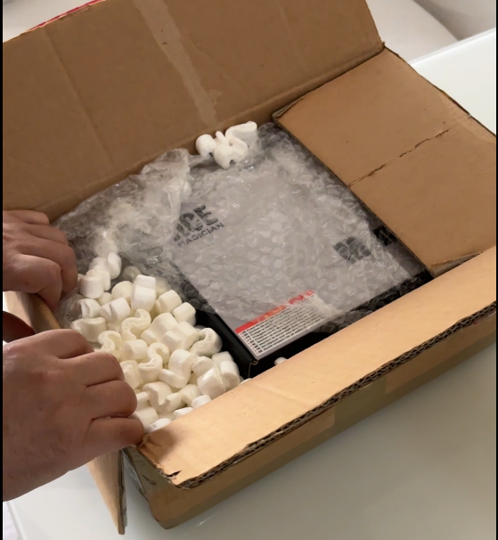
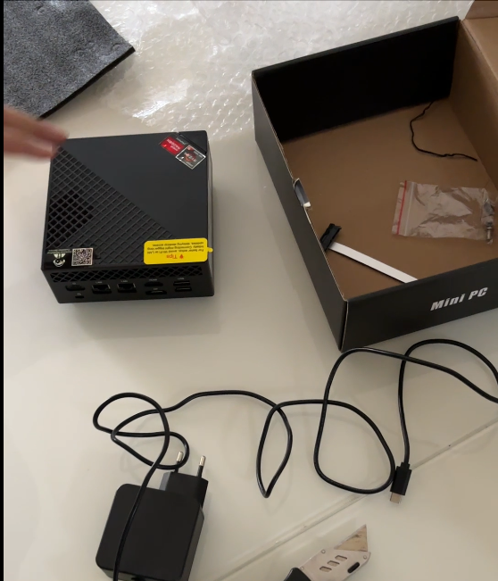
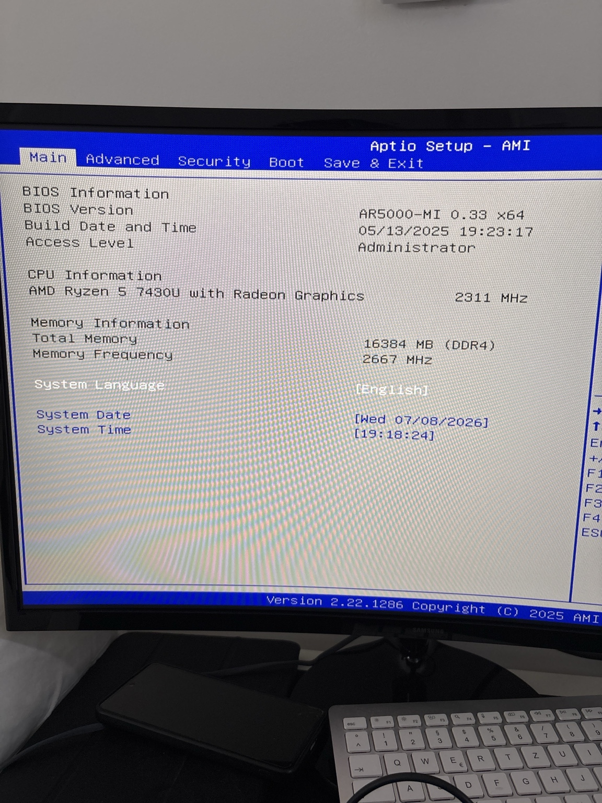
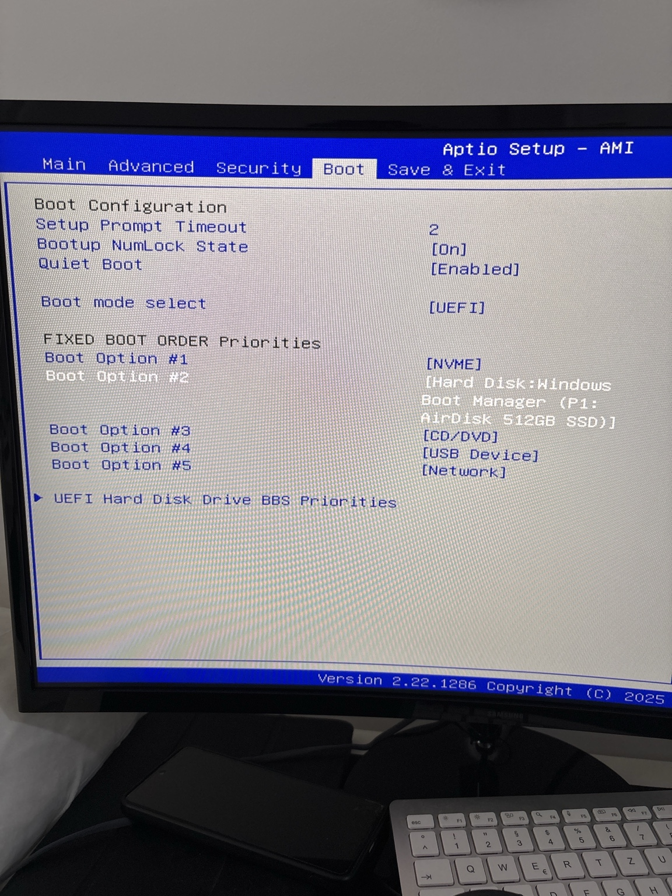

# 1 – Hardware Selection & Procurement

> **Status:** ✅ Completed

## Overview

Every HomeLab starts with the same question:

**Which hardware should I buy?**

Instead of purchasing an expensive enterprise server or a brand-new Mini PC, I wanted to build a reliable and energy-efficient HomeLab while keeping the overall budget as low as possible.

Rather than buying the first device that looked attractive, I wanted to go through a realistic selection process. My goal was to compare different systems, talk to multiple sellers, verify the hardware before purchasing, and safely buy a second-hand Mini PC that could become the foundation of my HomeLab.

---

## Budget & Requirements

Before I started searching, I set myself a strict maximum budget of **250 €**.

Having a fixed budget helped me stay focused on finding the best value instead of chasing higher specifications that I didn't actually need.

I also created a simple framework that every candidate had to meet.

Minimum requirements:

- Low power consumption (24/7 operation)
- Hardware virtualization support
- AMD Ryzen 5 or Intel Core i5 (or better)
- Minimum 16 GB RAM
- Minimum 512 GB SSD
- Dual Gigabit Ethernet (preferred)

This prevented me from making impulsive buying decisions whenever I saw an attractive listing.

---

## Market Research

For about a week, I monitored the German second-hand market on **Kleinanzeigen**.

Every day I checked newly listed Mini PCs and compared them based on:

- CPU performance
- RAM capacity
- SSD size
- Power consumption
- Upgradeability
- Network interfaces
- Price
- Seller reliability

Whenever I found a promising device, I contacted the seller before making any decision.

---

## Communicating with Sellers

Before buying any second-hand computer, I always tried to collect as much technical information as possible.

Some of the questions I regularly asked were:

- Is the BIOS password protected?
- Has the computer ever been repaired?
- Could you send BIOS screenshots?
- Could you send a CPU screenshot from Task Manager?
- Could you send a CrystalDiskInfo screenshot showing the SSD health?
- Do you have the original invoice or proof of purchase?
- Is the device fully functional?
- Are you willing to sell using Kleinanzeigen Buyer Protection ("Sicher bezahlen")?

I noticed that honest sellers usually had no problem answering these questions or providing additional photos.

---

## Learning to Avoid Risks

This phase also taught me several important lessons.

One seller had a Mini PC that I really liked, but he only accepted a normal PayPal payment and refused to use Buyer Protection.

Although the hardware looked good, I decided not to continue because protecting my money was more important than getting the device.

Another seller suddenly stopped responding to my messages.

About a day later, Kleinanzeigen itself sent me a warning recommending that I should not purchase anything from that seller.

That experience confirmed that being patient is much safer than rushing into a purchase.

---

## Final Decision

After comparing several Mini PCs and communicating with different sellers, I finally decided to purchase the following system.

| Component | Specification |
|-----------|---------------|
| Model | ACE MAGICIAN AM06PRO |
| CPU | AMD Ryzen 5 7430U (6 Cores / 12 Threads) |
| Memory | 16 GB DDR4 |
| Storage | 512 GB SSD |
| Network | Dual Gigabit Ethernet |
| Purchase Price | **200 €** |

I purchased the Mini PC using **Kleinanzeigen Buyer Protection ("Sicher bezahlen")**, which meant the payment would only be released after I had received the device and confirmed that it matched the seller's description.

### Seller Photos

| Front View | Rear Ports | Product Label |
|------------|------------|---------------|
|  |  |  |

---

## Delivery

The Mini PC arrived about four days after I placed the order.

The device arrived securely packaged and well protected during shipping.

| Shipping Box | Unboxing | Mini PC & Accessories |
|--------------|-----------|-----------------------|
|  |  |  |

Since my long-term goal is to manage this HomeLab remotely, I didn't buy a dedicated monitor, keyboard, or mouse for the Mini PC.

For the initial setup and hardware verification, I simply used the monitor, keyboard, and mouse that I normally use with my MacBook.

---

## Initial Hardware Verification

Before installing any software, I entered the BIOS to verify that the installed hardware matched the seller's description.

During this initial check, I verified:

- BIOS version
- CPU model
- Installed memory
- Memory frequency
- Boot mode (UEFI)
- Boot device

The BIOS information matched the expected CPU and memory configuration, so I continued with the operating system setup.

| BIOS Information | Boot Configuration |
|------------------|--------------------|
|  |  |

> **Note**
>
> At this stage, I only verified the installed hardware. The SSD health and overall system stability were tested later from within Windows before approving the purchase.

---

## SSD Health Check

After completing the Windows setup, I installed **CrystalDiskInfo** to check the condition of the SSD before approving the purchase.

Since this was a second-hand Mini PC, I wanted to make sure that the SSD was healthy and free from any obvious signs of excessive wear or hardware issues.

The results showed:

- SSD health status: **Good**
- Temperature: **33 °C**
- No SMART warnings were reported
- SMART status: **Healthy**

The SSD matched the specifications provided by the seller and showed no signs of hardware problems, giving me enough confidence to proceed with the purchase.

| CrystalDiskInfo |
|-----------------|
|  |

> **Why CrystalDiskInfo?**
>
> CrystalDiskInfo provides a quick overview of an SSD's SMART information, including its health status, temperature, and potential hardware issues. It is one of the first tools I use when evaluating a second-hand computer.

---

## Functional Testing

Before confirming the purchase, I wanted to make sure that the system was stable.

I performed several basic tests, including:

- Watching 4K YouTube videos
- Opening multiple applications
- Checking general responsiveness
- Listening for unusual fan noise
- Looking for freezes or crashes

The Mini PC remained quiet, responsive, and completely stable throughout the testing process.

The tests were not intended to benchmark performance, but simply to verify that the system behaved normally under a light real-world workload.

Once I was satisfied that everything was working correctly, I confirmed the delivery in Kleinanzeigen and released the payment to the seller.

This officially completed the procurement phase.

---

## Lessons Learned

This first phase taught me several valuable lessons.

- Define your budget before you start looking at hardware.
- Compare multiple devices instead of buying the first attractive option.
- Ask sellers for technical evidence before purchasing.
- BIOS screenshots and CrystalDiskInfo are extremely useful.
- Always use Buyer Protection whenever possible.
- Verify the hardware yourself before trusting the seller's description.
- Trust your own verification more than the seller's description.
- A little patience can save both money and unnecessary problems.

---

## Personal Note

This HomeLab is not intended to be built in a single day.

One of my goals is to document every important decision, every mistake, and every lesson I learn along the way.

I hope this documentation helps anyone who wants to build a similar HomeLab without spending a fortune.

---

## Next Step

With the hardware verified and the purchase completed, the Mini PC was ready for the next stage of the project.

➡️ **Installing Proxmox VE**
