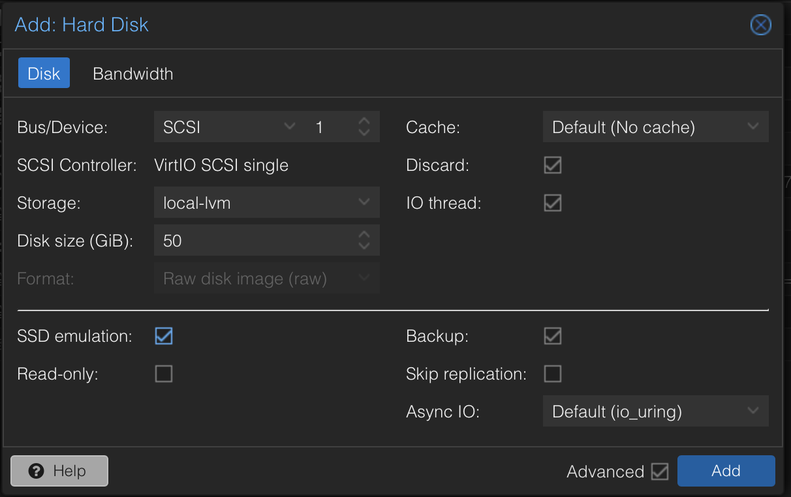
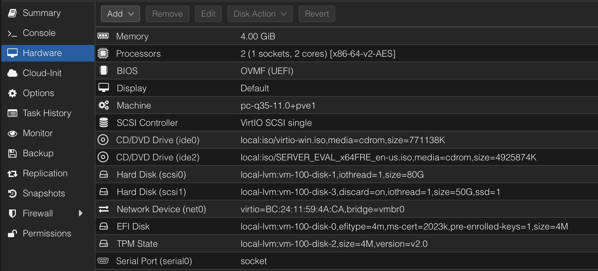
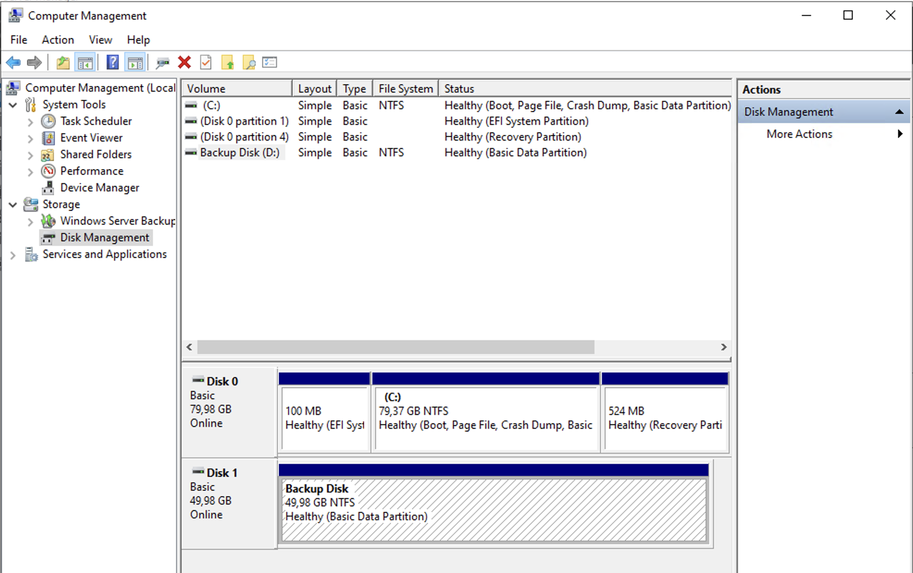
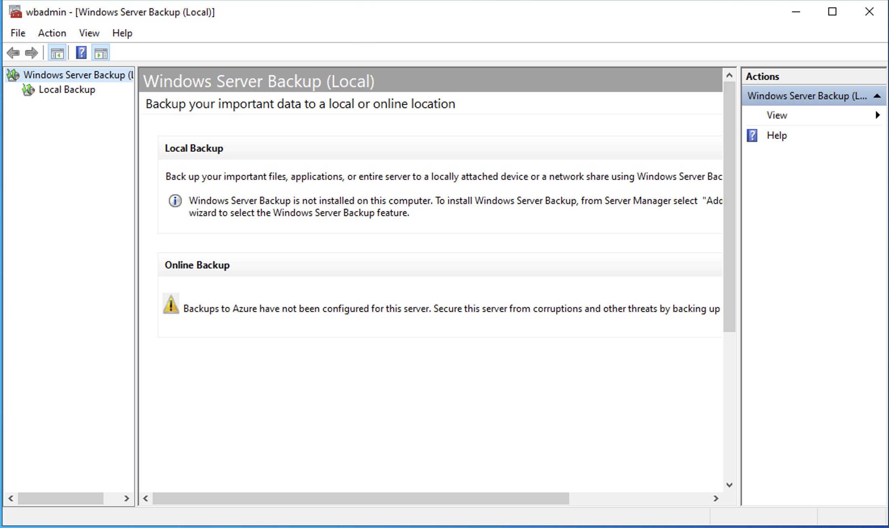
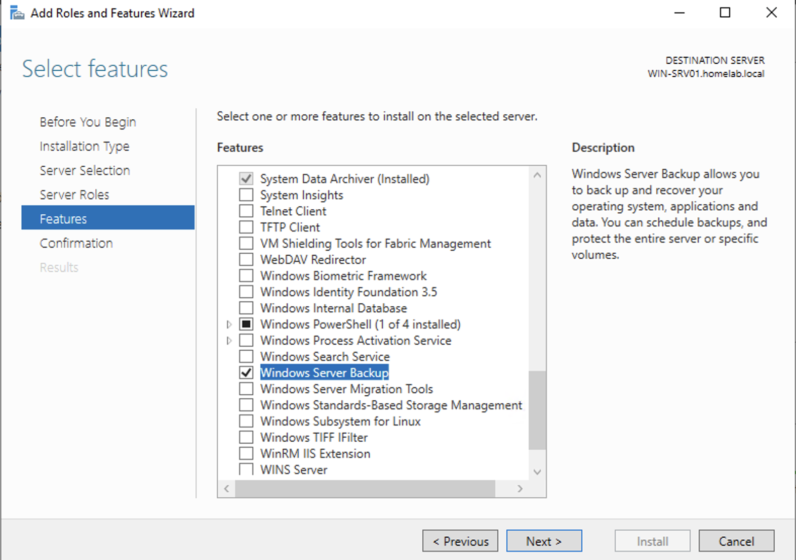
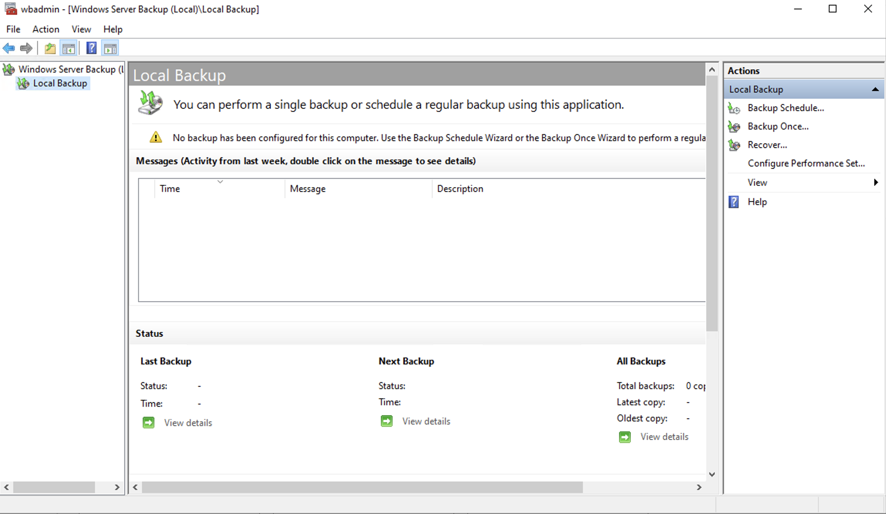
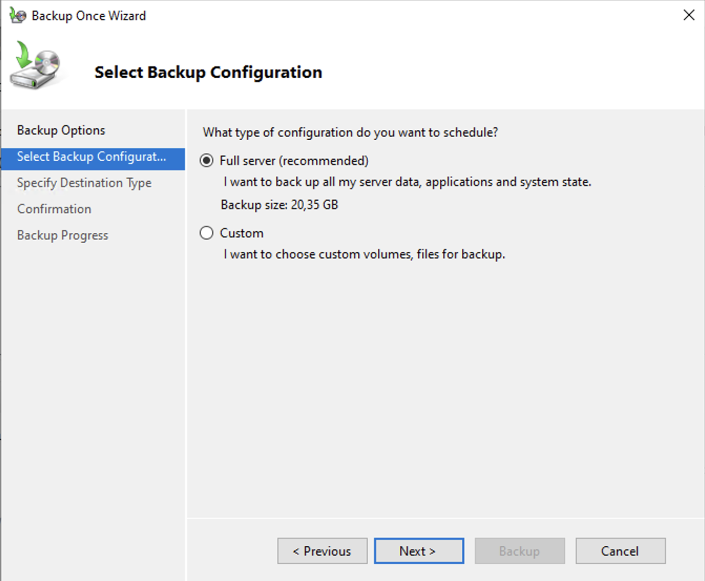
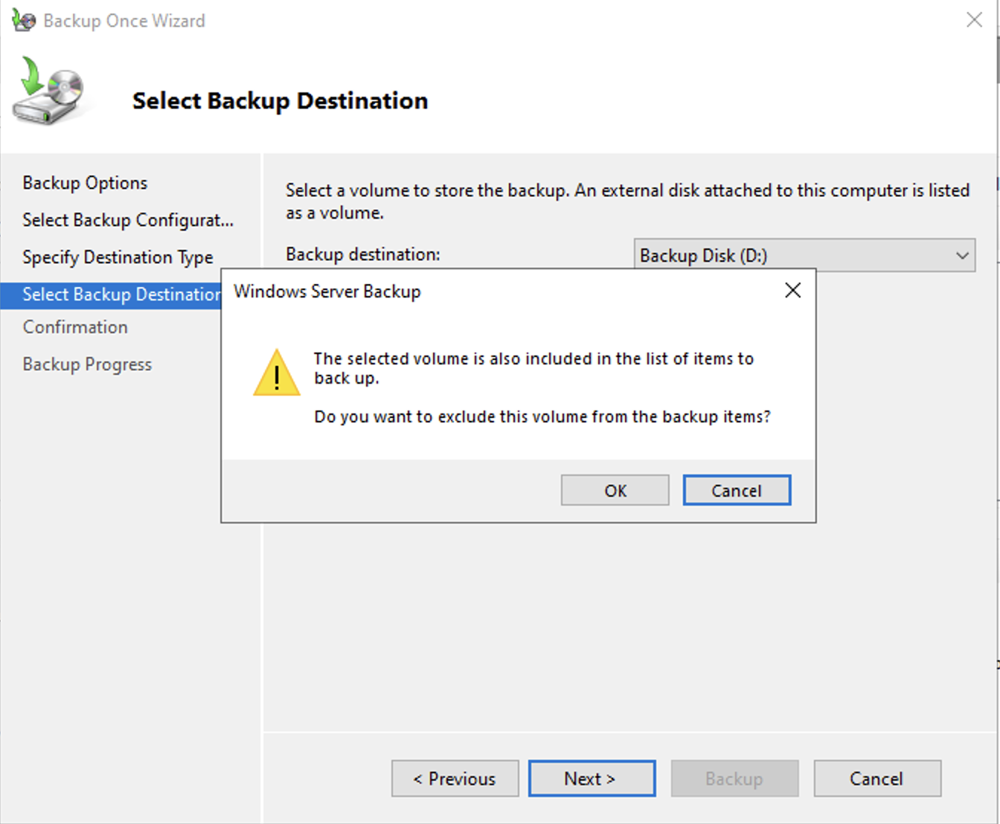
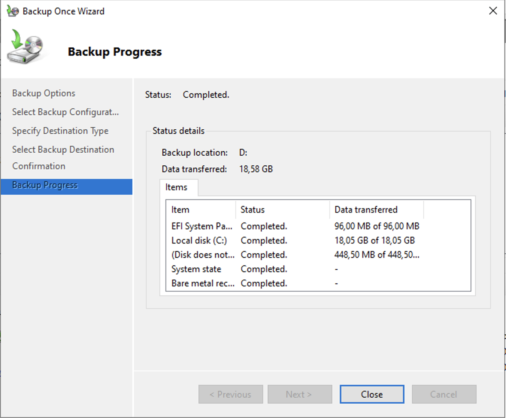
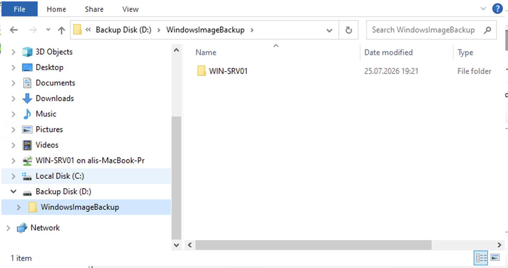

# Windows Server Backup

> **Status:** ✅ Completed

---

## Overview

Windows Server includes a built-in backup solution called **Windows Server Backup**. It provides a simple way to back up and restore a Windows Server without installing additional software.

For small environments, home labs, or basic backup requirements, Windows Server Backup is a practical solution. However, larger production environments often require more advanced backup and disaster recovery features provided by enterprise backup solutions.

In the next phase of this HomeLab project, I will also implement **Veeam Backup & Replication**, one of the most widely used enterprise backup solutions, to compare both solutions and learn how each one works in a HomeLab environment.

---

## Objectives

- Learn how to use Windows Server Backup.
- Configure a dedicated backup storage volume.
- Create and verify a Full Server Backup.
- Understand the difference between Windows Server Backup and enterprise backup solutions.
- Prepare the backup environment for the upcoming Veeam Backup & Replication implementation.

---

## Environment

| Component | Value |
|-----------|-------|
| Operating System | Windows Server 2022 Standard Evaluation |
| Backup Software | Windows Server Backup |
| Backup Destination | Dedicated Virtual Backup Disk |
| Backup Disk Size | 50 GB |
| Virtualization Platform | Proxmox VE |

---

## Backup Strategy

To keep the backup environment separate from the operating system, I first created a dedicated **50 GB virtual disk** in Proxmox and attached it to the Windows Server virtual machine.

This disk is used to store Windows Server backups. It will also be reused in the next phase while testing Veeam Backup & Replication.

Since this HomeLab uses a single Windows Server running multiple roles—including Active Directory, DNS, Group Policy, File Server, and Print Server—I selected **Full Server Backup**.

In a production environment, these roles are usually installed on separate servers. Since this HomeLab uses a single Windows Server for testing, a Full Server Backup was the most practical choice.

---

## Implementation

### 1. Create a Dedicated Backup Disk

A new **50 GB virtual disk** was created in Proxmox and attached to the Windows Server virtual machine.

After Windows detected the disk, I initialized it, formatted it with NTFS, and assigned the drive letter **D:**.

| Add Virtual Disk in Proxmox | Hardware Overview |
|:---------------------------:|:-----------------:|
|  |  |

| Windows Disk Management (D: Drive Ready) |
|:----------------------------------------:|
|  |

---

### 2. Install Windows Server Backup

Windows Server Backup is not installed by default. I installed the feature using **Server Manager → Add Roles and Features**.

| Verification (Not Installed) | Installing the Feature |
|:----------------------------:|:----------------------:|
|  |  |

Once the installation was complete, I opened the Windows Server Backup console.

| Windows Server Backup Console |
|:-----------------------------:|
|  |

---

### 3. Configure a Full Server Backup

A one-time backup was created using the **Backup Once** wizard.

I selected **Full Server Backup** because this server runs multiple infrastructure roles in a single virtual machine.

The backup protects:

- Operating System
- Active Directory and DNS
- Group Policy
- File Server and Print Server
- EFI System Partition
- System State
- Bare Metal Recovery

The backup destination was configured to use the dedicated backup disk (**D:**).

| Backup Configuration | Backup Warning / Confirmation |
|:--------------------:|:-----------------------------:|
|  |  |

---

### 4. Verify the Backup

After the backup completed successfully, I verified both the backup status in the console and the backup files stored on the dedicated backup disk.

| Backup Completed | Backup Files on D: Drive |
|:----------------:|:------------------------:|
|  |  |

---

## Lessons Learned

- Windows Server Backup is an easy-to-use built-in backup solution for Windows Server.
- Adding a dedicated backup disk in Proxmox keeps backup data separate from the operating system disk.
- Full Server Backup protects the operating system, installed server roles, System State, EFI System Partition, and Bare Metal Recovery.
- Windows Server Backup is well suited for small environments and HomeLab testing.
- Enterprise environments often use more advanced backup solutions such as Veeam Backup & Replication.

---

## Conclusion

In this phase, I configured and tested Windows Server Backup using a dedicated backup disk.

The backup completed successfully, and the backup files were verified on the dedicated backup disk.

In the next phase, I will implement **Veeam Backup & Replication** to explore an enterprise backup solution widely used in professional IT environments.

---

## Navigation

| Previous | Home | Next |
|:--------:|:----:|:----:|
| ⬅️ [Print Server Configuration](../10–Print-Server-Configuration/README.md) | 🏠 [Home](../../README.md) | ➡️ Veeam Backup & Replication *(Coming Soon)* |
