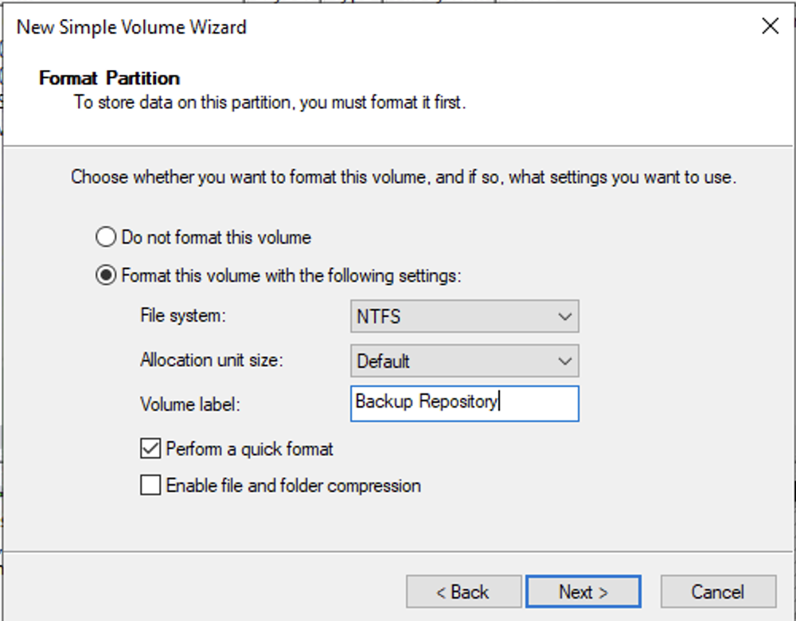
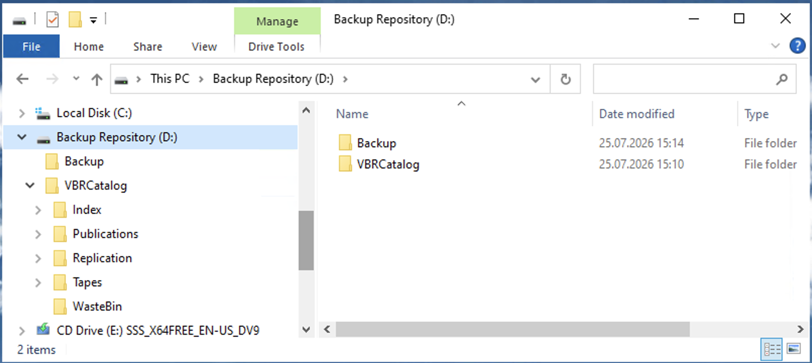
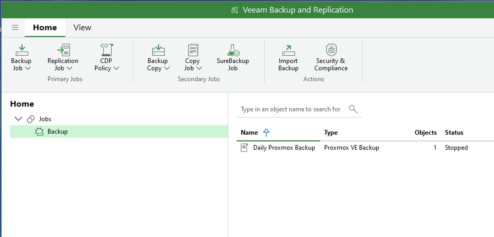
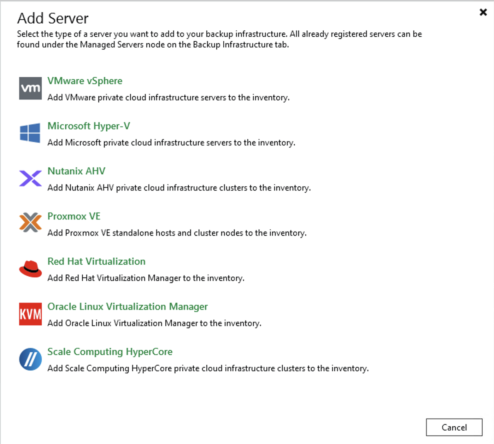
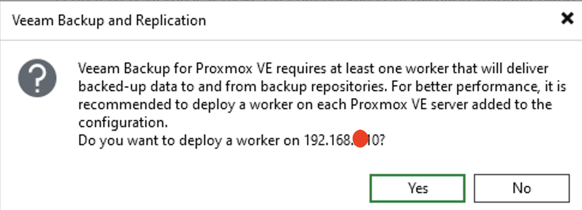
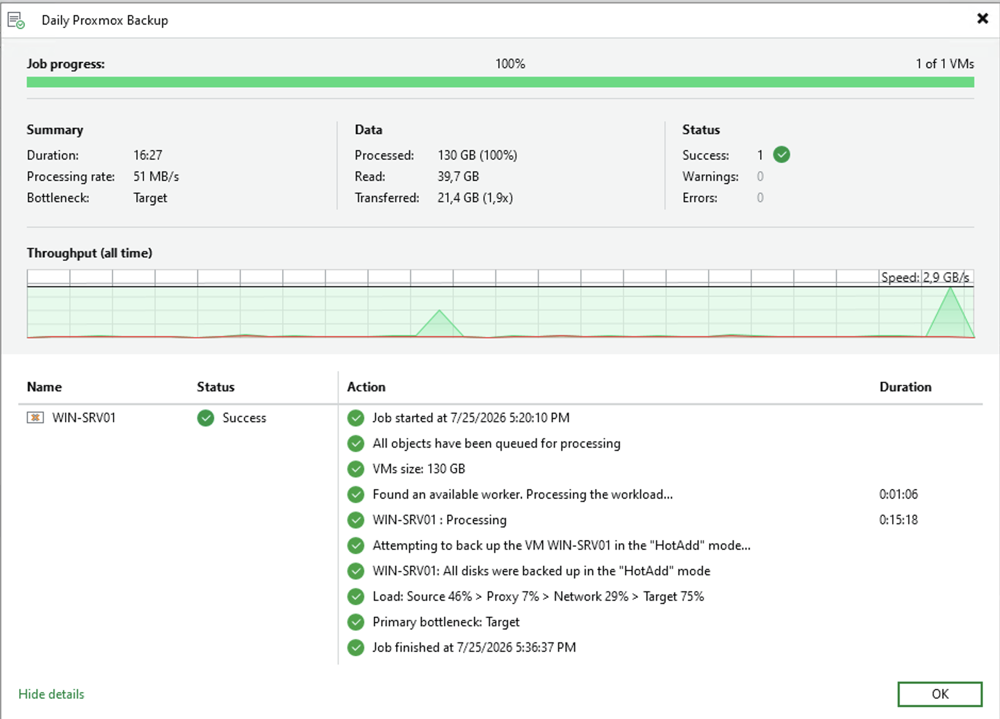
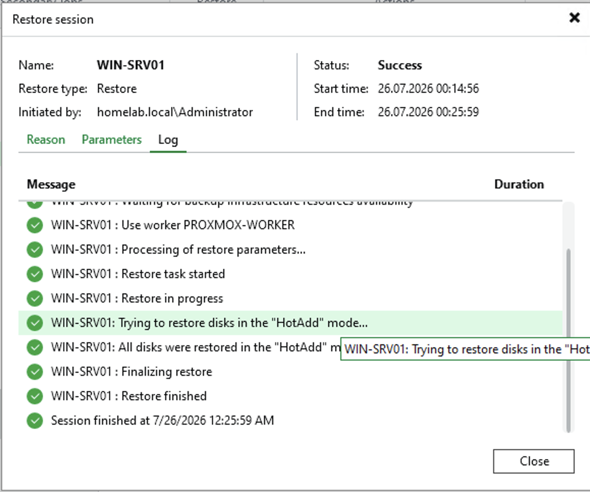

# Veeam Backup & Replication

> **Status:** ✅ Completed

---

## Overview

In this phase, I deployed **Veeam Backup & Replication Community Edition** to protect my Proxmox virtual machines.

I created a dedicated backup server named **BACKUP01**, configured a local backup repository, and connected my Proxmox VE host to Veeam.

Finally, I created my first backup job and verified the backup by performing a successful Full VM Restore.

---

## Objectives

- Create a dedicated backup server.
- Install Veeam Backup & Replication.
- Configure a local backup repository.
- Add the Proxmox VE host.
- Deploy the Proxmox Worker appliance.
- Create the first backup job.
- Test the backup by performing a Full VM Restore.

---

## Windows Server Backup vs. Veeam

Windows Server includes its own backup tool, which is suitable for basic backup tasks.

For this HomeLab, I wanted to learn a backup solution that is commonly used to protect virtual machines. For that reason, I chose **Veeam Backup & Replication Community Edition**.

Compared to Windows Server Backup, Veeam provides:

- Image-based virtual machine backups
- Incremental backups
- Centralized management
- Restore options for individual files and applications

---

## 1. Prepare the Backup Server & Repository

Before installing Veeam, I created a dedicated virtual machine named **BACKUP01** in Proxmox.

After installing Windows Server, I renamed the server to **BACKUP01**, joined it to the **homelab.local** domain, and prepared it for the Veeam installation.

I also added a dedicated **100 GB virtual disk** for the backup repository. The disk was initialized, formatted with NTFS, and assigned the drive letter **D:**.

| Format Repository Disk (NTFS) | Backup Repository Ready (D:) |
|:-----------------------------:|:----------------------------:|
|  |  |

---

## 2. Install Veeam Backup & Replication

I installed **Veeam Backup & Replication Community Edition** using the default installation options.

The installation automatically configured the required services, the PostgreSQL database, and the Veeam management console.

| Veeam Backup & Replication Console |
|:----------------------------------:|
|  |

---

## 3. Configure the Backup Infrastructure

To protect virtual machines, Veeam first needs access to the virtualization platform.

I added my Proxmox VE host using SSH credentials.

After the connection was established, Veeam deployed a **Proxmox Worker**. The worker is responsible for transferring backup and restore data between Proxmox and the backup repository.

| Add Proxmox VE Host | Deploy Proxmox Worker |
|:-------------------:|:---------------------:|
|  |  |

---

## 4. Create the First Backup

After the backup infrastructure was ready, I created my first backup job for the **WIN-SRV01** virtual machine.

The backup completed successfully without any warnings or errors.

While reviewing the job log, I noticed that Veeam automatically used **HotAdd** mode. In this mode, the virtual disks are attached directly to the worker appliance, which reduces network traffic and improves backup performance.

| Backup Job Success Log |
|:----------------------:|
|  |

---

## 5. Test the Restore Process

Creating backups is only one part of a backup strategy. It is also important to verify that the backups can be restored.

To test the backup, I performed a **Full VM Restore**.

The restore completed successfully and confirmed that the virtual machine could be recovered from the backup.

| Full VM Restore Success Log |
|:---------------------------:|
|  |

---

## Lessons Learned

- Veeam makes it easy to manage backups from a single console.
- A dedicated backup repository helps keep backup data separate from the operating system.
- The Proxmox Worker is required for backup and restore operations.
- Reviewing the job logs helps understand how Veeam processes backup jobs.
- Testing the restore process is just as important as creating backups.

---

## Result

In this phase, I successfully deployed Veeam Backup & Replication in my HomeLab.

The backup infrastructure was configured, the first backup completed successfully, and the restore test confirmed that the virtual machine could be recovered.

---

## Navigation

| Previous | Home | Next |
|:--------:|:----:|:----:|
| ⬅️ [Windows Server Backup](../11-Windows-Backup-Server/README.md) | 🏠 [Home](../../README.md) | ➡️ [Windows Server Update Services](../12-WSUS/README.md) |
