## Why Proxmox VE?

Before starting this HomeLab project, I compared a few virtualization platforms, such as VMware ESXi, Microsoft Hyper-V, XCP-ng, and Proxmox VE.

I chose Proxmox VE because it is free, open source, and easy to use. It has a simple web interface and supports both Virtual Machines and Linux Containers. It also has a large community with many helpful guides.

A friend first recommended Proxmox VE to me. After comparing different platforms, I decided that it was the best choice for my HomeLab.

# Installing Proxmox VE

## 1. Download Proxmox VE

Download the latest Proxmox VE ISO image from the official website.

🔗 https://www.proxmox.com/en/downloads

| Proxmox Website | Proxmox ISO Download |
|-----------------|----------------------|
| 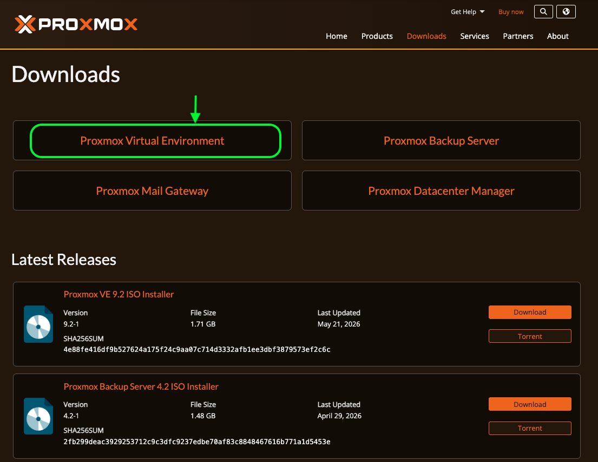 | 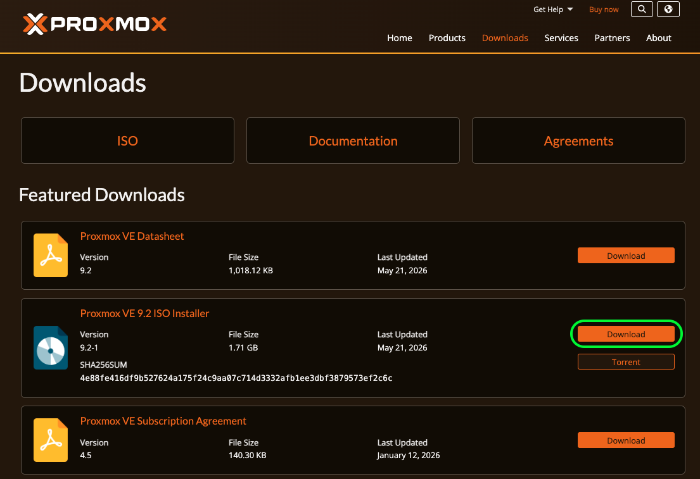 |

---

## 2. Create a Bootable USB

I created the bootable USB on my MacBook using **Balena Etcher**.

If you use Windows, you can use **Rufus** or another tool that creates bootable USB drives.

### Balena Etcher

Official website:

🔗 https://etcher.balena.io/

| Website | Download | Application |
|---------|----------|-------------|
| 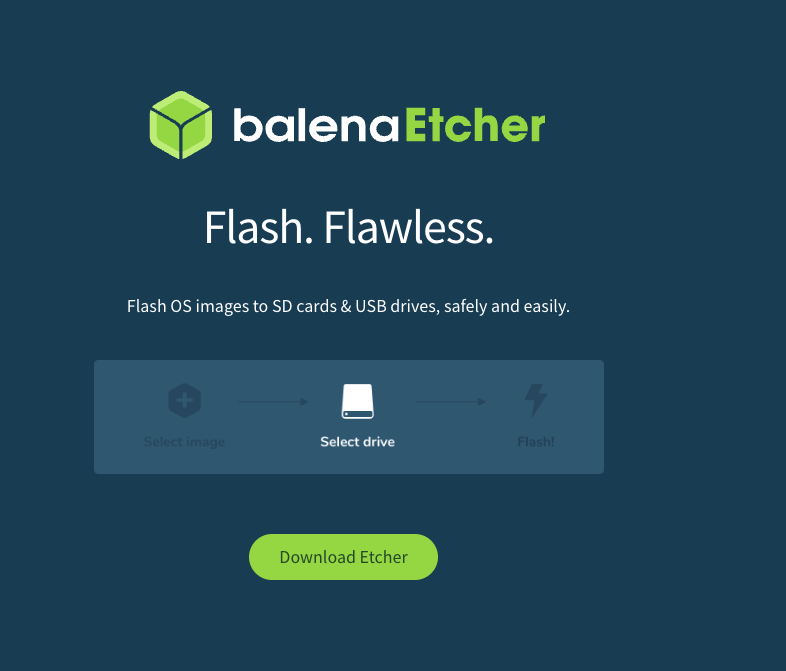 | 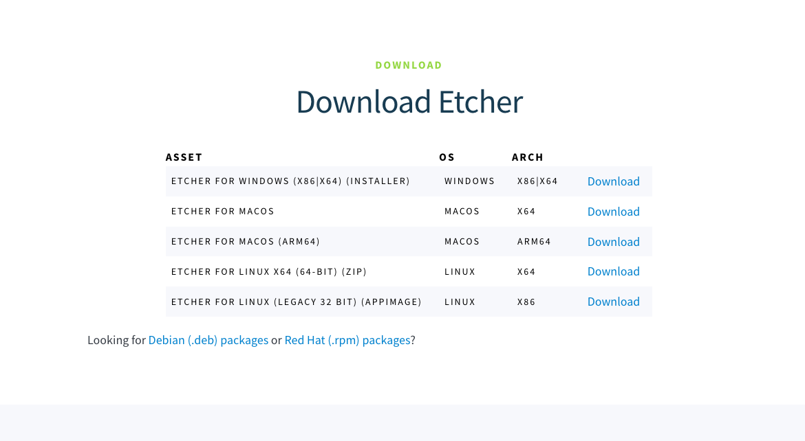 | 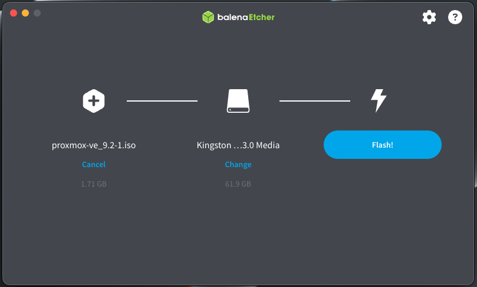 |

> **Note**
>
> I used Balena Etcher because I prepared the installation USB on macOS.

---

### Windows Alternative

If you use Windows, **Rufus** is another popular tool for creating bootable USB drives.

Official website:

🔗 https://rufus.ie/

| Website | Download |
|---------|----------|
| 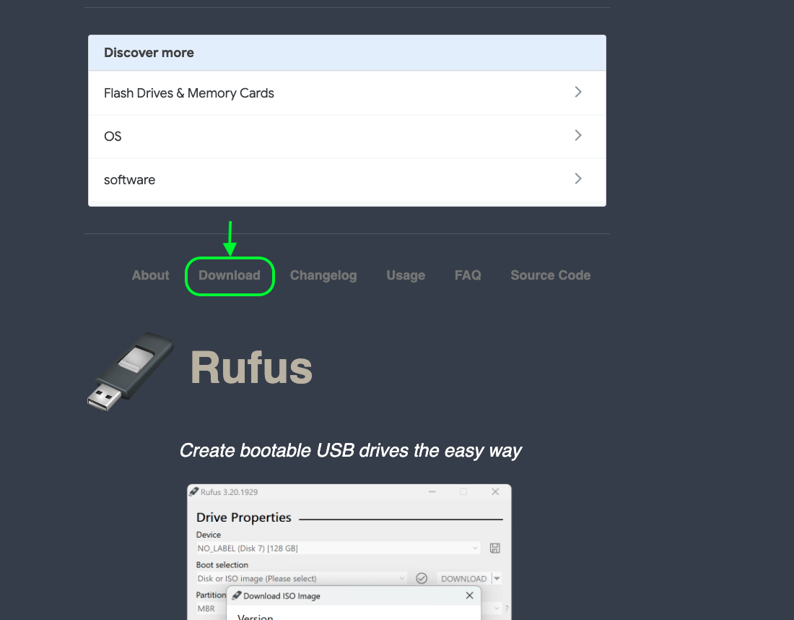 | 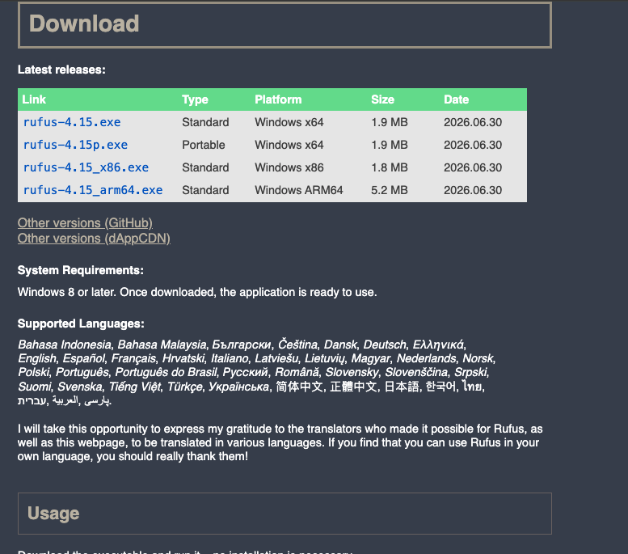 |

---

## 3. Connect the Server to the Network

Before starting the installation, connect the Mini PC to your router with an Ethernet cable.

I use an Ethernet connection because this HomeLab will run different servers and network services. Later, I also plan to use both LAN ports, including one for a firewall. For this reason, I do not use Wi-Fi.

---

## 4. Configure the BIOS

Before installing Proxmox VE, check the following BIOS settings:

- Enable hardware virtualization.
  - AMD: **SVM Mode**
  - Intel: **Intel VT-x**
- Set **UEFI** as the boot mode.
- Set the USB drive as the first boot device.

| Enable Virtualization | Set USB as First Boot Device |
|:---------------------:|:----------------------------:|
| 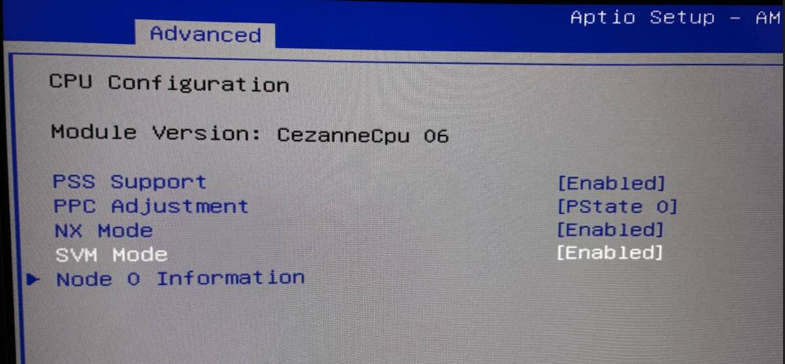 | 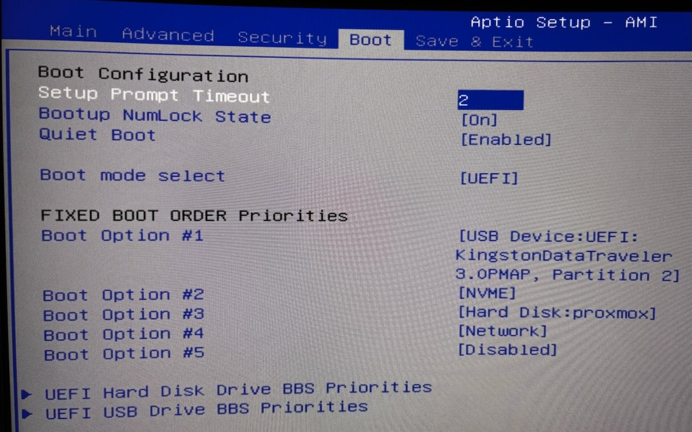 |
| **SVM Mode: Enabled** | **UEFI boot with USB as the first boot device** |

> **Note**
>
> Proxmox needs hardware virtualization to run virtual machines.
> On AMD systems, this setting is called **SVM Mode**.
> On Intel systems, it is usually called **Intel VT-x**.

---

## 5. Install Proxmox VE

Boot the Mini PC from the USB drive and start the Proxmox VE installer.

Follow the installation wizard and complete each step.

| Welcome | Network Configuration |
|:-------:|:---------------------:|
| 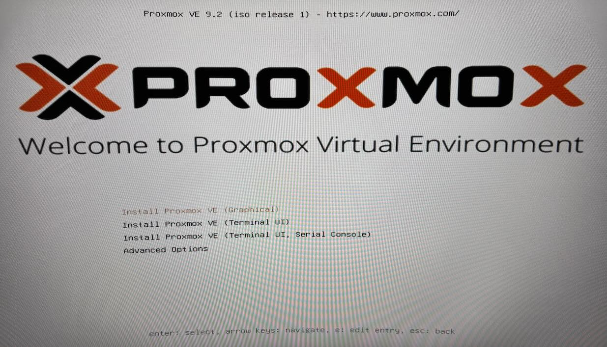 | 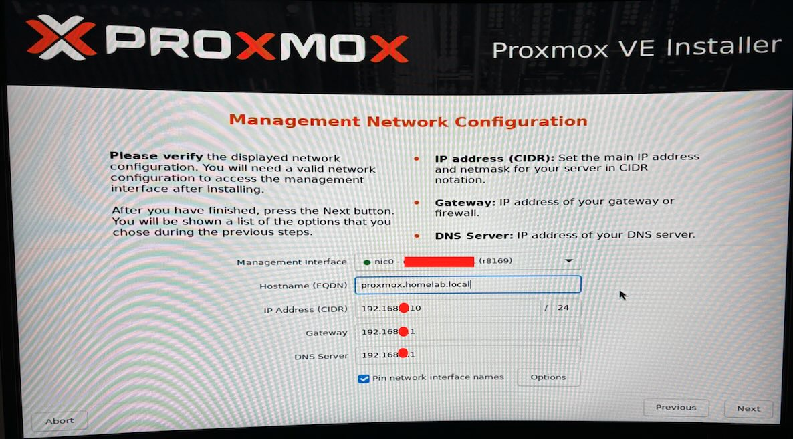 |

### Installation Notes

- Select the SSD where Proxmox VE will be installed.
- All existing data on the selected disk will be deleted.
- Choose your country, time zone, and keyboard layout.
- Create a strong root password.
- Enter a valid email address for system notifications.
- Configure a static IP address for the Proxmox server.
- Check the network settings before you start the installation.

> **My Configuration**
>
> - Hostname: `proxmox.homelab.local`
> - Static IP Address: `192.168.x.10/24`
> - Gateway: `192.168.x.1`
> - DNS Server: `192.168.x.1`

---

## 6. First Login

After the installation is complete, Proxmox displays the management URL on the console.

Open the URL in a web browser:

`https://192.168.x.10:8006`

The browser will show a security warning because Proxmox uses a self-signed SSL certificate.

Click **Advanced**, continue to the website, and log in with the **root** account and the password you created during the installation.

| Console | Browser Security Warning |
|:-------:|:------------------------:|
| 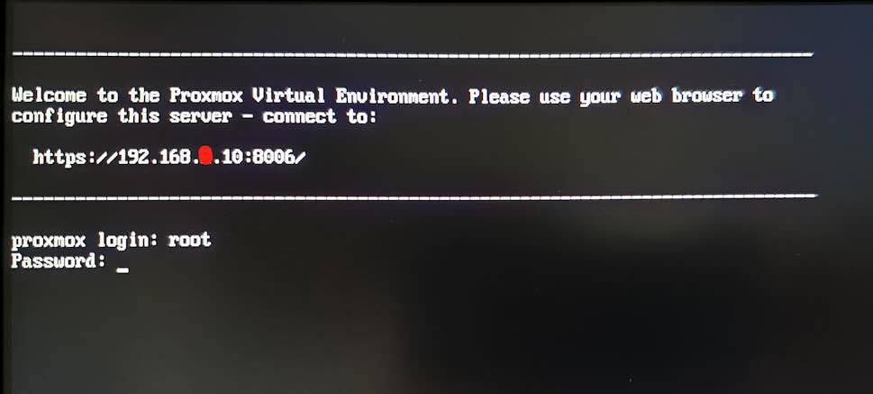 | 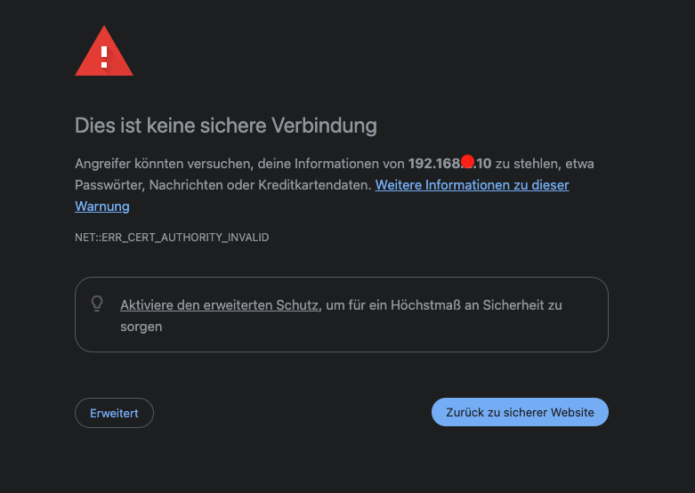 |

| Login Screen | Proxmox Dashboard |
|:------------:|:-----------------:|
| 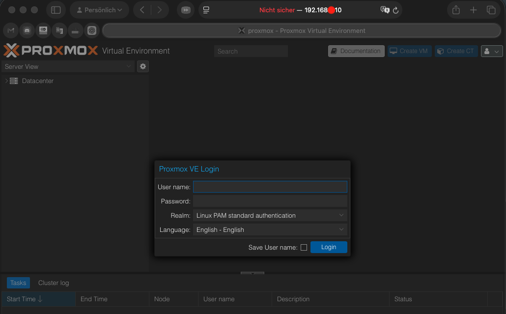 | 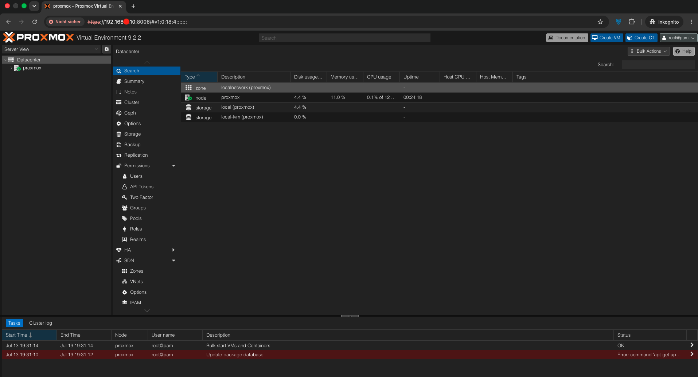 |

---

The basic Proxmox VE installation is now complete.

In the next section, I will configure Proxmox VE, fix the default package repository, update the system, and prepare the server for the next steps of this HomeLab project.
