# 3 – Proxmox Post-Installation Configuration

> **Status:** ✅ Completed

---

## Overview

After installing Proxmox VE, I completed the first configuration tasks to prepare the server for future virtual machines and containers.

The main goals were to configure the software repositories, install the latest updates, verify the network configuration, and understand the default storage layout.

---

## Objectives

- Configure the correct software repositories
- Install all available system updates
- Verify the running kernel version
- Check the network configuration
- Understand the default storage structure
- Prepare the server for virtual machines

---

## Why This Configuration Matters

A fresh Proxmox installation is not fully ready for daily use.

Before creating virtual machines, it is important to configure the repositories, install updates, verify the network settings, and understand the storage layout.

These tasks create a stable foundation for the rest of the HomeLab.

---

## Initial Situation

After the installation, Proxmox VE was running correctly.

However, I noticed that system updates failed because the Enterprise Repository was enabled by default. Since this HomeLab does not use a paid subscription, I needed to replace it with the official No-Subscription repository.

This had to be fixed before continuing.

---

## Step 1 – Repository Configuration

### The Problem

When I looked at the bottom of the Proxmox dashboard, I saw the following error message:

`Error: command 'apt-get update' failed`

This happens because Proxmox VE enables the **Enterprise Repository** by default. Without a paid subscription, the server cannot download updates from these repositories.

| Update Error | Enterprise Repository |
|:------------:|:---------------------:|
|  | 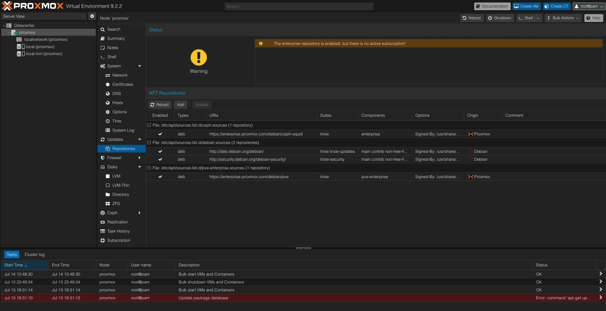 |

---

### The Solution

To fix this, I disabled the Enterprise Repository and enabled the official No-Subscription Repository.

From the Proxmox web interface:

1. Open **Node (proxmox) → Updates → Repositories**
2. Disable the **pve-enterprise** repository.
3. Add the **No-Subscription** repository.

This repository is officially provided by Proxmox and is commonly used in HomeLab environments.

| Add No-Subscription Repository | Repository Configuration Complete |
|:------------------------------:|:---------------------------------:|
|  |  |

---

## Step 2 – Update the System

After fixing the repositories, I refreshed the package database from the **Updates** page.

This time, the refresh completed successfully without any errors.

| Package Database Refresh |
|:------------------------:|
| 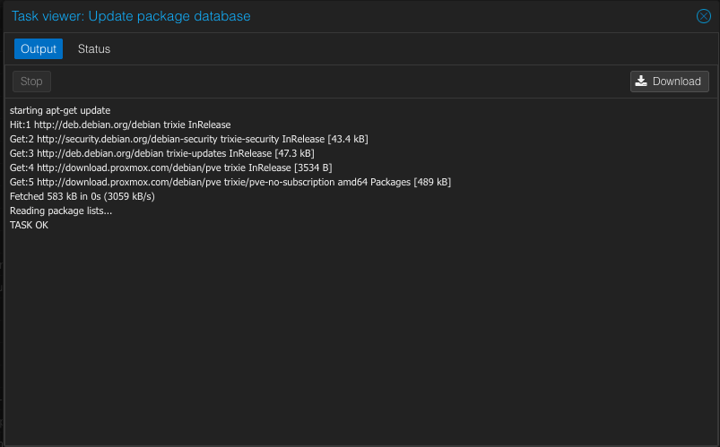 |

Next, I upgraded all installed packages from the Proxmox shell.

### Commands

```bash
apt update
apt full-upgrade
```

The system downloaded and installed the latest packages, including a new Linux kernel.

After the installation finished, Proxmox recommended rebooting the server to activate the new kernel.

| System Upgrade | Upgrade Completed |
|:--------------:|:----------------:|
| 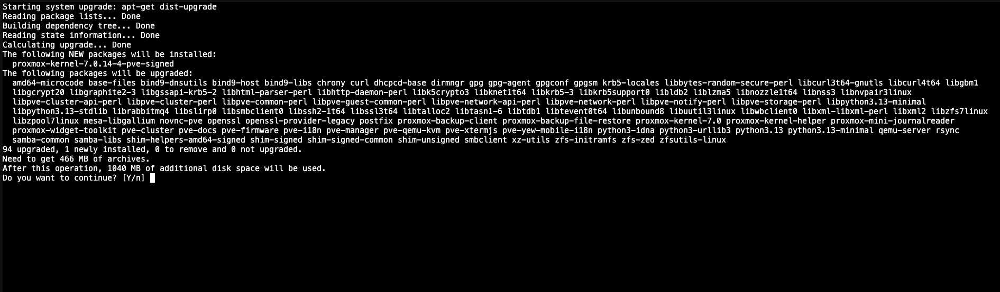 | 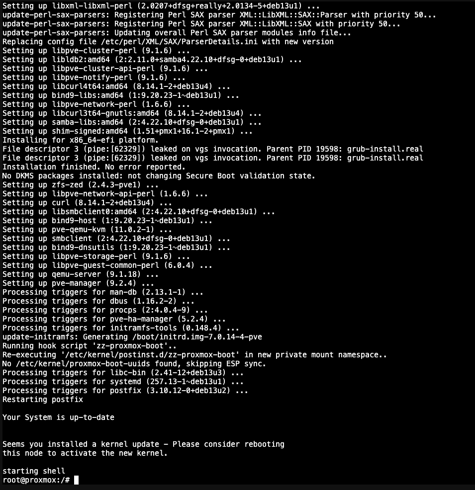 |

After the reboot, the **Updates** page confirmed that no updates were available.

| System Up-to-Date |
|:-----------------:|
| 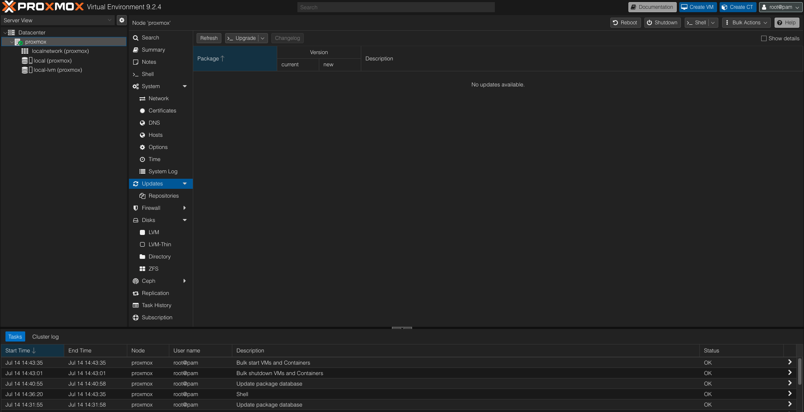 |

---

## Step 3 – Verify the Installation

After rebooting, I verified that the new kernel was running correctly.

### Commands

```bash
pveversion
uname -r
```

The output confirmed that the latest Proxmox version and kernel were active.

| Version Verification |
|:--------------------:|
| 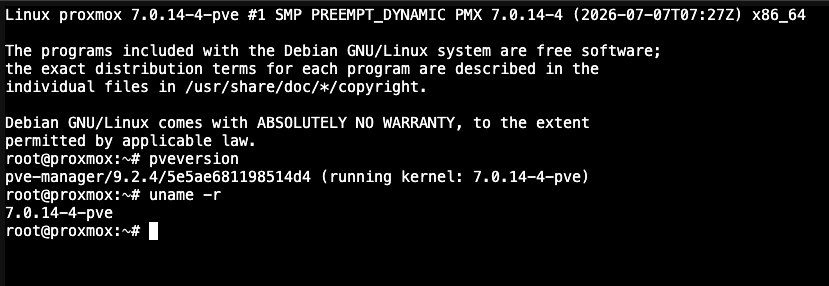 |

---

## Step 4 – Network Verification

The next step was checking the network configuration.

For security reasons, I redacted my Machine IDs, MAC addresses, IPv6 addresses, and other unique system identifiers from the screenshots.

I verified:

- Hostname
- IP address
- Default gateway
- DNS server
- Linux bridge (vmbr0)

### Commands

```bash
hostnamectl
ip -br addr
ip route
cat /etc/resolv.conf
```

| Network Configuration (GUI) | Network Verification (CLI) |
|:---------------------------:|:--------------------------:|
| 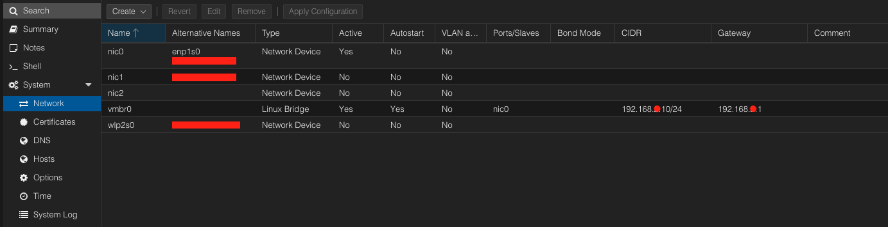 | 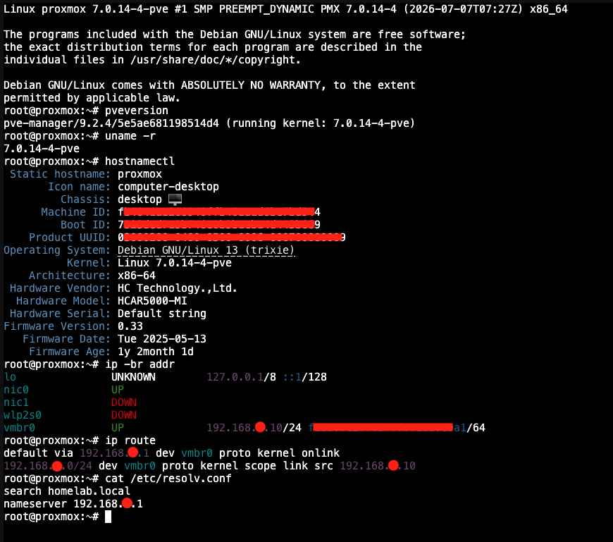 |

Everything matched my planned network configuration.

---

## Step 5 – Storage Overview

Before creating any virtual machines, I explored the default storage layout.

By default, Proxmox creates two storage types during the installation.

## local (Directory)

This storage is mainly used for files such as:

- ISO images
- Container templates
- Backup files

## local-lvm (LVM-Thin)

This storage is used for virtual disks such as:

- Virtual machine disks
- Container disks

Understanding this difference is important because each storage has a different purpose.

For example, ISO installation files belong in **local**, while virtual machine disks are stored in **local-lvm**.

This storage layout also matches how I organized virtual machines in VMware Workstation and VirtualBox.

In the past, I kept my ISO installation files in a separate folder and created a clean virtual machine after every operating system installation. Before making any changes, I kept a copy of this clean VM so I could quickly start over without installing the operating system again.

Because of this experience, the Proxmox storage structure felt familiar and easy to understand.

| Storage Overview | ISO Images | VM Disks |
|:----------------:|:----------:|:--------:|
| 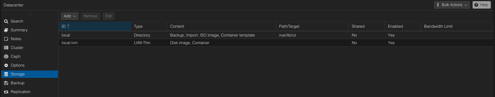 | 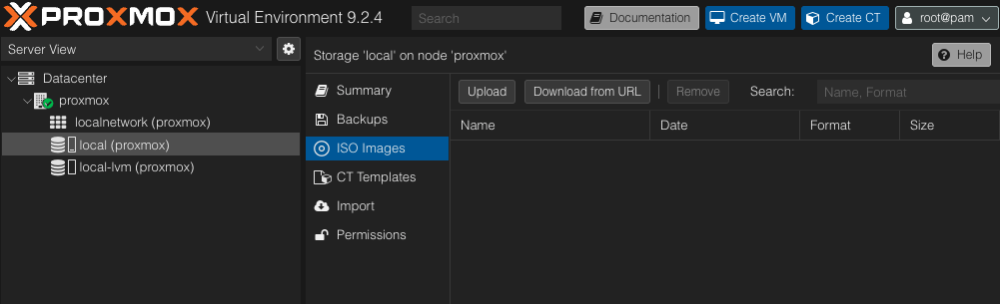 | 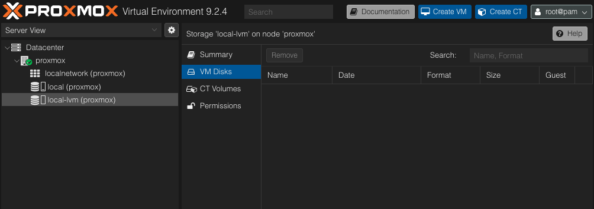 |

---

## Final Configuration Summary

| Component | Status |
|-----------|--------|
| Repository | ✅ No-Subscription configured |
| System Update | ✅ Completed |
| Kernel | ✅ Verified |
| Network | ✅ Verified |
| Storage | ✅ Verified |

---

## Lessons Learned

This phase helped me understand:

- Why Proxmox uses different software repositories
- How to safely update a Proxmox server
- How to verify the running kernel version
- How the default storage layout works
- Why the Linux bridge (**vmbr0**) is important
- Where ISO files and virtual machine disks should be stored
- How Proxmox storage is similar to the way I previously organized virtual machines in VMware Workstation and VirtualBox

---

## Next Steps

The Proxmox server is now fully updated and ready for use.

The next phase will focus on creating the first virtual machine by installing Windows Server and starting the Microsoft infrastructure for this HomeLab.

---

> **Note:**  
> All screenshots in this document were taken from my own HomeLab during the installation and configuration process. Sensitive information such as machine IDs, MAC addresses, and other unique identifiers has been redacted for security reasons.

---

## Navigation

| Previous | Home | Next |
|----------|------|------|
| ⬅️ [Proxmox Installation](../2-Proxmox/Readme.md) | 🏠 [Home](../../README.md) | ➡️ [Windows Server Installation](../4-Windows-Server/Readme.md) |


