# Windows Server 2022 Installation

> **Status:** ✅ Completed

## Project Overview

In this phase, I installed **Windows Server 2022** on my Proxmox server.

This virtual machine will be used later for:

- Active Directory
- DNS
- DHCP
- Group Policy
- File Server

The goal is to build a small enterprise environment for learning and testing.

---

## Why Windows Server?

Windows Server is one of the most common operating systems in enterprise environments.

It provides the core services used in many company networks, such as Active Directory, DNS, DHCP, Group Policy, and File Services.

Windows Server is an important part of the HomeLab because I want to simulate a real company environment.

---

## Windows Server License

For this HomeLab, I used the official **Windows Server 2022 Evaluation** edition provided by Microsoft.

The evaluation version is free to use for learning and testing and includes all the features needed for this project.

---

## Installation Media

I used two ISO files during the installation.

| File | Purpose |
|------|---------|
| Windows Server 2022 Evaluation ISO | Windows Server installation |
| VirtIO Driver ISO | Drivers for Proxmox virtual hardware |

The Windows Server ISO was downloaded from the official Microsoft Evaluation Center.

The VirtIO Driver ISO was downloaded from the official Fedora Project. It provides the drivers required for Proxmox virtual hardware, including the storage controller, network adapter, balloon driver, and VirtIO serial driver used by the QEMU Guest Agent.

**Downloads**

- Windows Server 2022 Evaluation  
  https://www.microsoft.com/en-us/evalcenter/download-windows-server-2022

- VirtIO Driver ISO  
  https://fedorapeople.org/groups/virt/virtio-win/direct-downloads/latest-virtio/

---

### Download Information

| Item | Value |
|------|-------|
| Operating System | Windows Server 2022 Evaluation |
| Architecture | 64-bit |
| Format | ISO |
| VirtIO Drivers | Latest Stable ISO |
| Source | Microsoft Evaluation Center / Fedora VirtIO |

---

## Uploading the Installation Media

Before creating the virtual machine, I uploaded both ISO files to **local (pve) → ISO Images**.

Uploading both files first makes the installation easier because the VirtIO drivers are already available when Windows Setup starts.

### Steps

1. Open the Proxmox Web Interface.
2. Select **local (pve)**.
3. Open **ISO Images**.
4. Click **Upload**.
5. Upload the Windows Server ISO.
6. Upload the VirtIO Driver ISO.

---

## Creating the Virtual Machine

### General

I created a new virtual machine using the following settings.

| Setting | Value |
|---------|-------|
| VM ID | 100 |
| VM Name | WIN-SRV01 |

I use simple and descriptive names for all virtual machines in this HomeLab. This makes them easier to identify later.

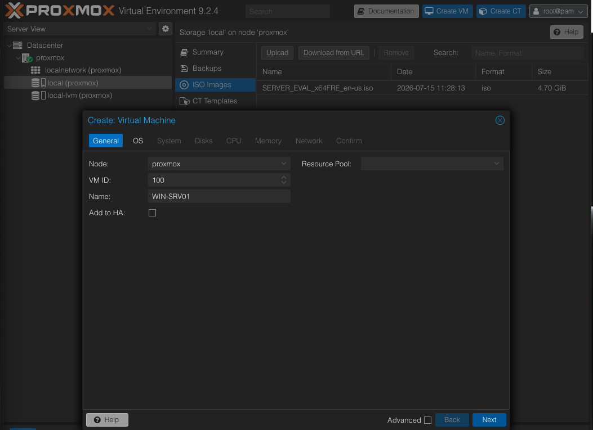

---

### Operating System

I selected the Windows Server 2022 Evaluation ISO that I uploaded earlier.

Then I changed the guest operating system from **Linux** to **Microsoft Windows** and selected version **11/2022/2025**.

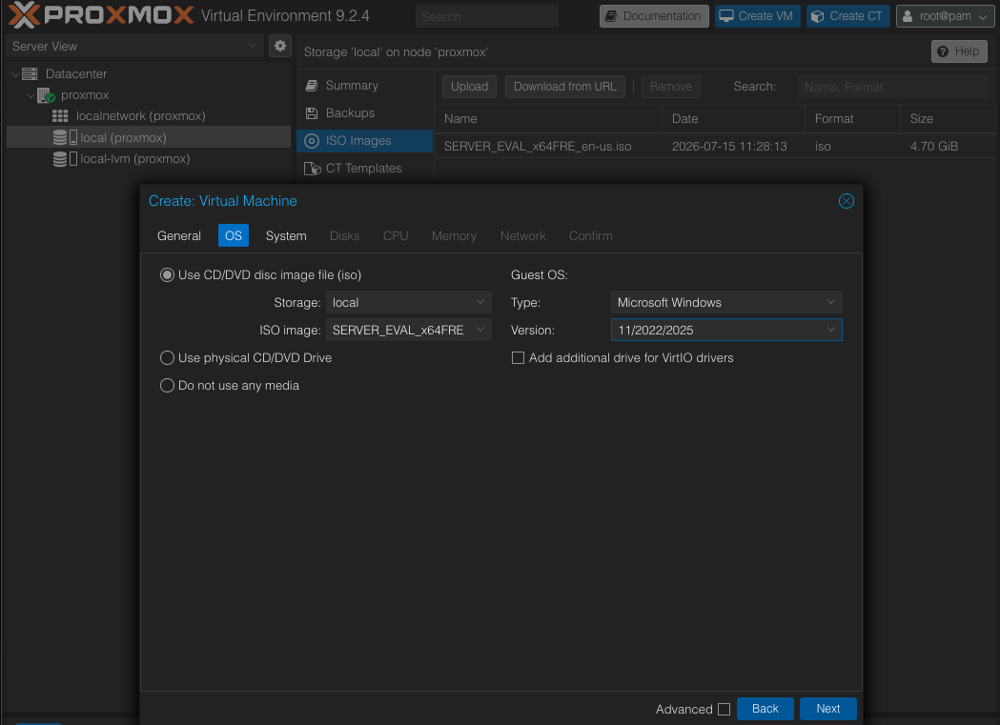

> [!TIP]
>
> Attach the **VirtIO Driver ISO** before starting the virtual machine.
>
> I first attached it after Windows Setup had already started and Windows could not detect the driver. Adding both ISO files before the first boot saves time and avoids restarting the installation.

---

### System

For the system configuration, I selected the settings below.

| Setting | Value |
|---------|-------|
| Machine | q35 |
| BIOS | OVMF (UEFI) |
| EFI Disk | Enabled |
| EFI Storage | local-lvm |
| TPM | Enabled |
| TPM Version | 2.0 |
| TPM Storage | local-lvm |
| SCSI Controller | VirtIO SCSI Single |
| QEMU Guest Agent | Disabled |

I chose these settings because they are recommended for modern Windows Server installations.

> **Note**
>
> I will install the QEMU Guest Agent after Windows Server is fully installed.

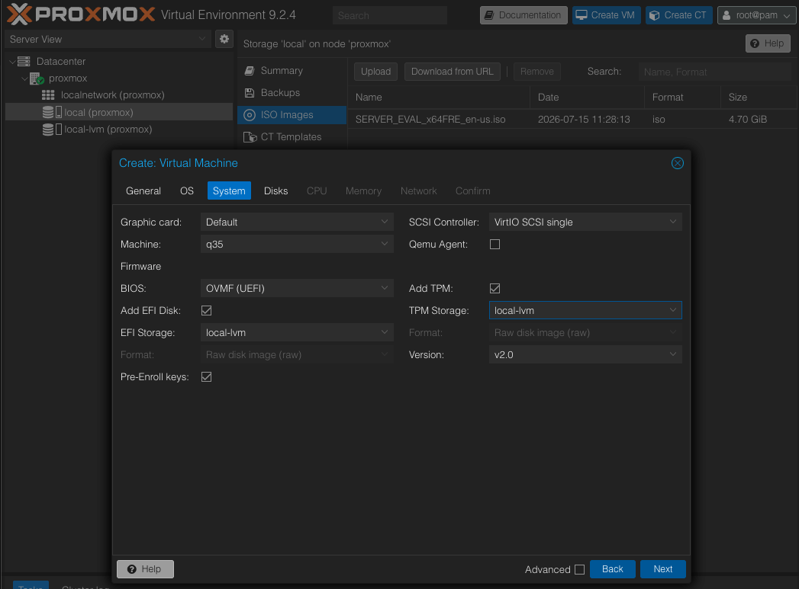

---

### Storage

I created an **80 GB** system disk using the **VirtIO SCSI** controller.

| Setting | Value |
|---------|-------|
| Bus/Device | SCSI |
| Controller | VirtIO SCSI Single |
| Storage | local-lvm |
| Disk Size | 80 GB |
| Format | RAW |
| IO Thread | Enabled |

I selected VirtIO SCSI because it offers better performance than the legacy IDE controller.

The system disk is only used for Windows Server. I will add another virtual disk later for the File Server.

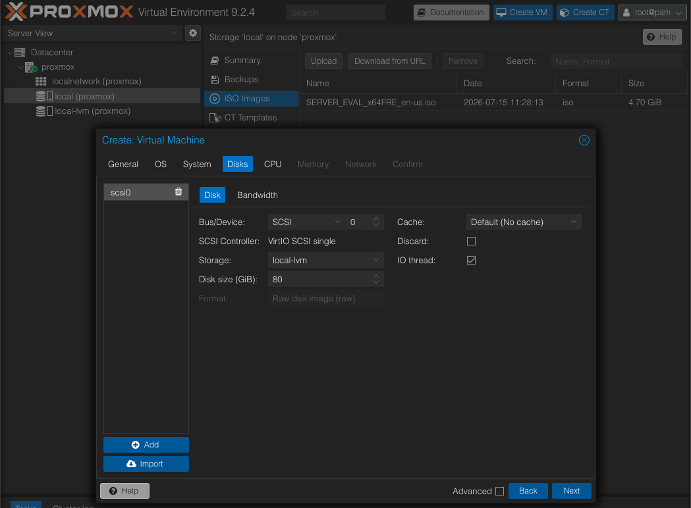

---

### CPU

I assigned **2 CPU cores** to the virtual machine.

| Setting | Value |
|---------|-------|
| Sockets | 1 |
| Cores | 2 |
| Type | x86-64-v2-AES (Default) |

For this HomeLab, two CPU cores are enough.

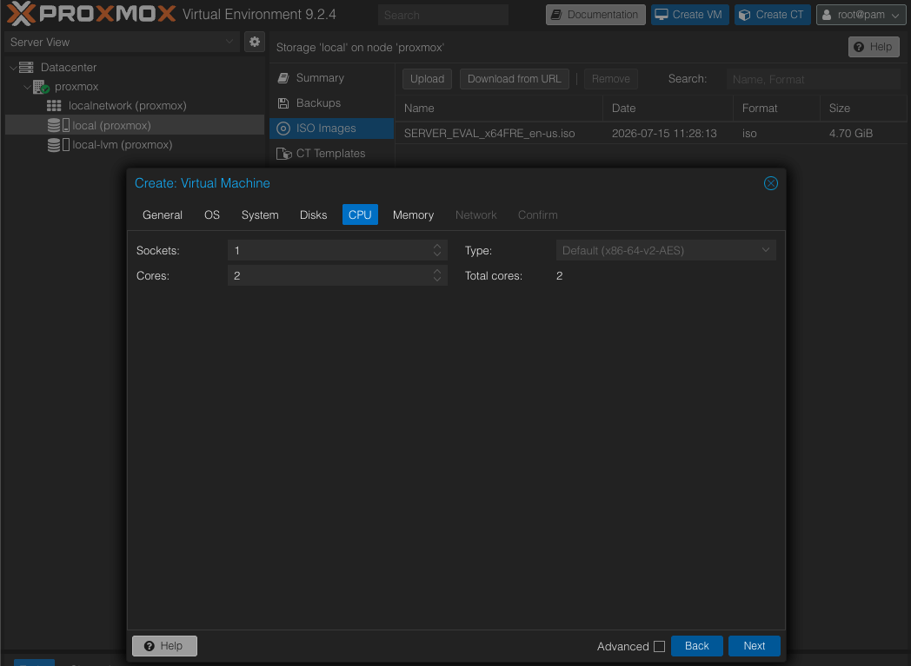

---

### Memory

I allocated **4 GB** of RAM.

| Setting | Value |
|---------|-------|
| Memory | 4096 MiB |
| Ballooning | Enabled |

4 GB is enough for Windows Server, Active Directory, DNS, and DHCP in a small HomeLab.

I left Ballooning enabled.

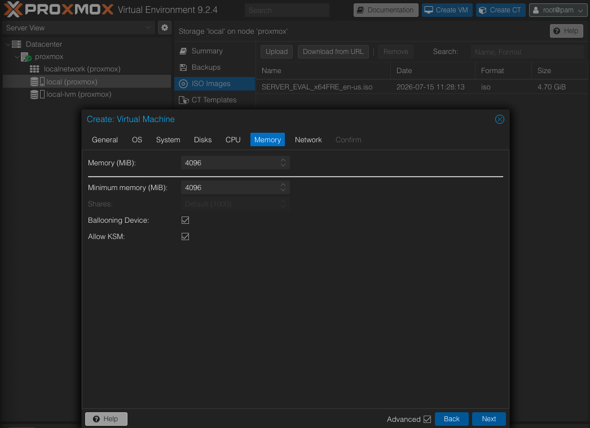

---

### Network

The virtual machine is connected to **vmbr0** using a **VirtIO** network adapter.

| Setting | Value |
|---------|-------|
| Bridge | vmbr0 |
| Model | VirtIO (Paravirtualized) |
| Firewall | Disabled |

I selected VirtIO because it provides better performance than the default Intel E1000 adapter.

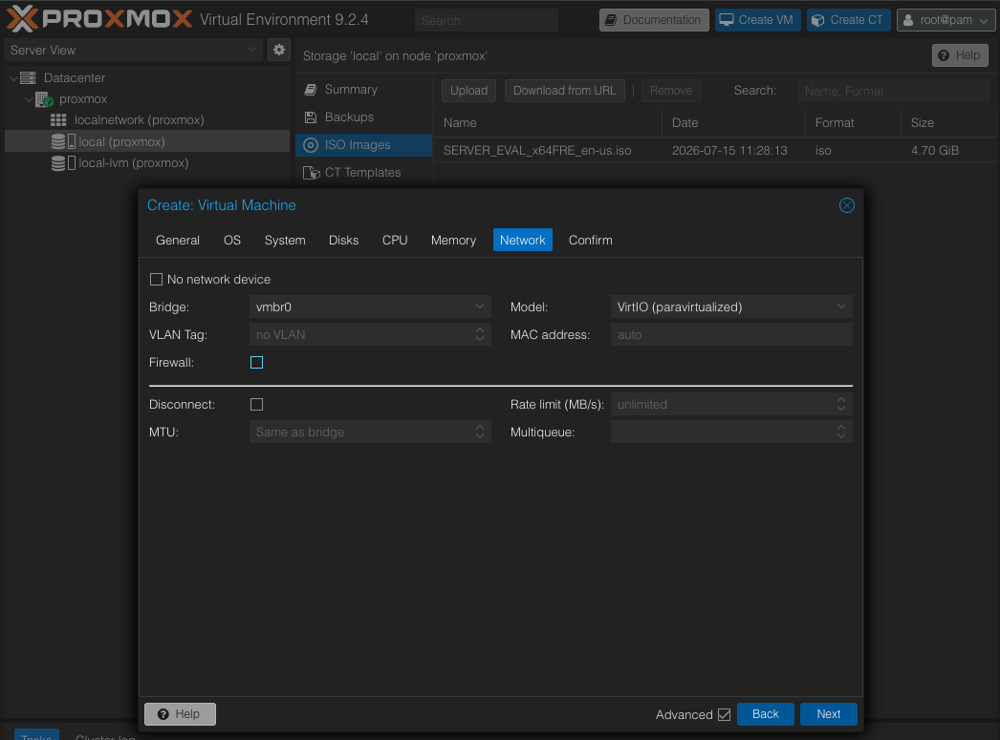

---

### Attach VirtIO Driver ISO

Before starting the virtual machine, I attached the **VirtIO Driver ISO** as a second CD/DVD drive.

I recommend doing this before the first boot. Windows Server needs the VirtIO drivers to detect the virtual disk.

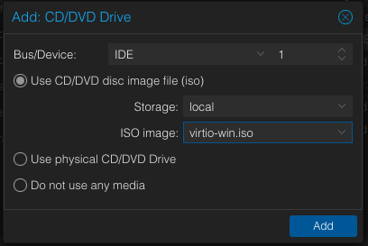

> [!TIP]
>
> During my first installation, I added the VirtIO ISO after Windows Setup had already started. Windows could not detect the new CD/DVD drive, so I had to restart the installation.
>
> Attaching both ISO files before the first boot avoids this problem.

---

### Virtual Machine Configuration

Before starting the installation, I checked the final configuration one last time.

The virtual machine was configured with:

- Windows Server 2022 Evaluation
- UEFI (OVMF)
- TPM 2.0
- VirtIO SCSI Storage
- VirtIO Network Adapter
- 2 CPU Cores
- 4 GB RAM
- 80 GB System Disk

Everything was ready, so I started the virtual machine and continued with the Windows installation.

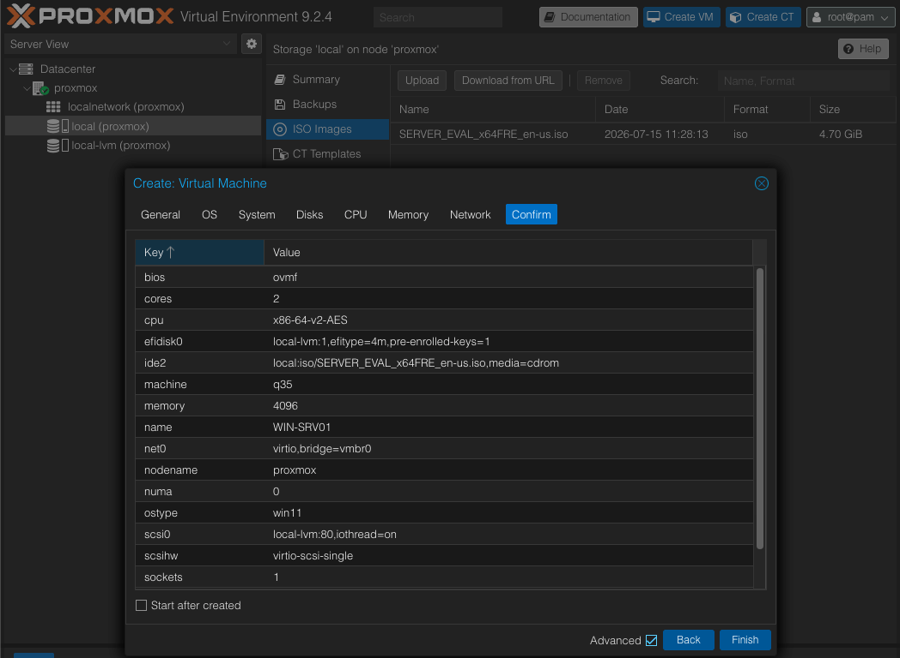

---

## Design Decisions

During the setup, I changed a few default Proxmox settings.

| Default | Selected | Reason |
|----------|----------|--------|
| Linux | Microsoft Windows | Windows Server installation |
| Legacy BIOS | UEFI | Recommended for Windows Server 2022 |
| Intel E1000 | VirtIO | Better network performance |
| IDE | VirtIO SCSI | Better disk performance |
| 32 GB Disk | 80 GB Disk | More space for future server roles |

---

## Windows Setup

After starting the virtual machine, Windows Server Setup opened automatically.

I selected:

- **Language:** English
- **Time and Currency Format:** Germany
- **Keyboard Layout:** German

I prefer using the operating system in English because most technical documentation and Microsoft resources use English. The German keyboard layout matches my physical keyboard.

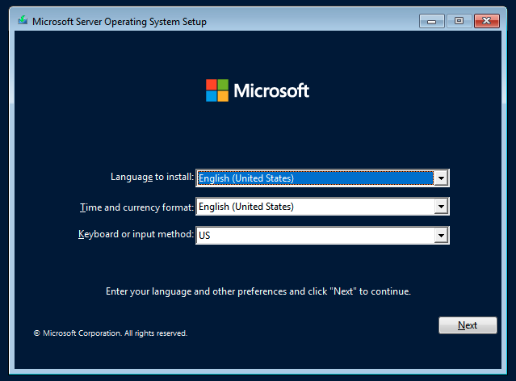

---

## Windows Server Edition

For this HomeLab, I selected:

**Windows Server 2022 Standard Evaluation (Desktop Experience)**

I chose the **Desktop Experience** edition because it is easier to learn Windows Server before moving to PowerShell and automation.

The Standard edition includes everything I need for this HomeLab.

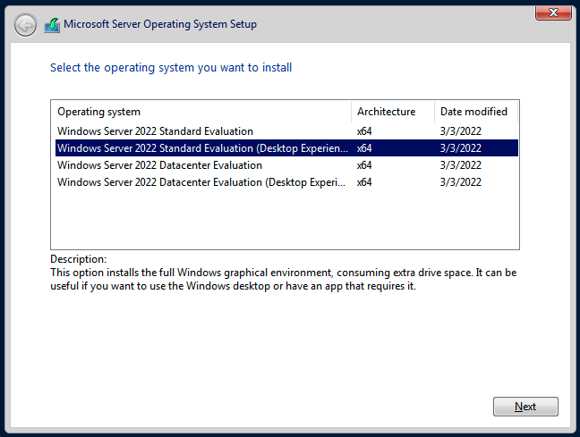

---

## Loading the VirtIO Storage Driver

When I reached the disk selection screen, Windows could not detect the virtual disk.

To solve this, I clicked **Load driver** and selected the **VirtIO SCSI driver (2k22)** from the VirtIO Driver ISO.

After loading the driver, Windows detected the virtual disk immediately.

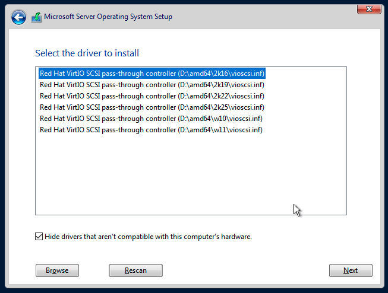

---

## Detecting the Virtual Disk

The virtual disk appeared after loading the VirtIO driver.

I selected the **80 GB** disk and continued the installation.

Windows automatically created the required system partitions.

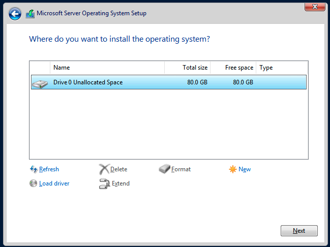

---

## Installing Windows Server

The installation continued automatically.

Windows copied the files, installed the operating system, and restarted the virtual machine. The installation took a few minutes and completed without any errors.

---

## Configure the Administrator Account

After the installation finished, Windows asked me to create a password for the built-in **Administrator** account.

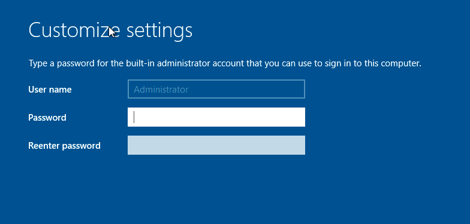

---

## First Sign-in

After signing in for the first time, Windows Server opened the desktop and started **Server Manager** automatically.

At this point, the operating system was installed successfully and the server was ready for the next phase of the project.

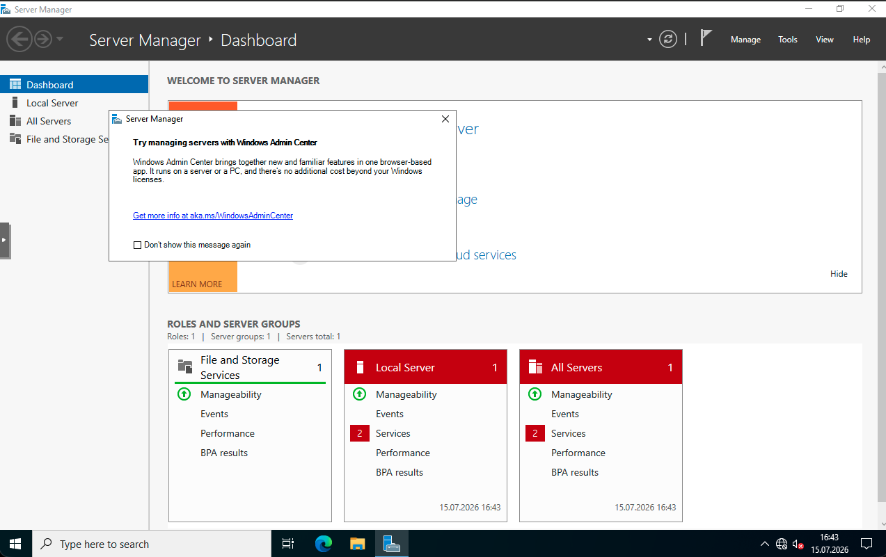

---

## Installing Remaining VirtIO Drivers

Windows Server does not include all drivers required for Proxmox virtual hardware.

During Windows Setup, I loaded the **VirtIO Storage Driver** so Windows could detect the virtual disk.

After the first sign-in, I installed the remaining VirtIO drivers:

- VirtIO Network Driver
- VirtIO Balloon Driver
- VirtIO Serial Driver

These drivers enabled the network connection, improved memory management, and allowed QEMU Guest Agent to communicate correctly with Proxmox.

---

## Troubleshooting

### VirtIO Driver ISO was not detected

During my first installation attempt, I attached the VirtIO Driver ISO after Windows Setup had already started.

Windows did not detect the newly added CD/DVD drive, so the required storage driver was not available.

I solved the problem by attaching the VirtIO Driver ISO as an **IDE CD/DVD drive** before starting the virtual machine.

After this experience, I updated this guide to include both ISO files before the installation begins.

---

### Windows Setup could not detect the virtual disk

Windows Setup could not detect the virtual disk because the VirtIO Storage Driver was not loaded.

Loading the correct VirtIO Storage Driver immediately made the virtual disk available.

---

### QEMU Guest Agent was not detected

The QEMU Guest Agent service was running inside Windows, but Proxmox still reported that the Guest Agent was not running.

After checking the hardware IDs in Device Manager, I found that the **VirtIO Serial Driver** was missing.

After installing the VirtIO Serial Driver and restarting the virtual machine, Proxmox was able to communicate with the guest operating system.

The VM's IP address appeared automatically in the Proxmox Summary page, confirming that the Guest Agent was working correctly.

---

## Lessons Learned

- Prepare both the Windows Server ISO and the VirtIO Driver ISO before creating the virtual machine.
- Attach the VirtIO Driver ISO before the first boot to avoid interrupting the installation later.
- Load the VirtIO Storage Driver during Windows Setup so Windows can detect the virtual disk.
- After Windows installation, install the remaining VirtIO drivers (Network, Balloon, and Serial) before continuing with the server configuration.
- Verify that networking, DNS, and QEMU Guest Agent are working before moving on to the next phase.

---

## Conclusion

Windows Server 2022 is now running successfully on my Proxmox server.

The server is now ready for the next step of this HomeLab project:

- Active Directory Domain Services (AD DS)
- DNS
- DHCP
- Group Policy
- File Server

The next step is to promote this server to the first Domain Controller.

---

## Navigation

| Previous | Home | Next |
|----------|------|------|
| ⬅️ [Proxmox Configuration](../3-Proxmox-Configuration/README.md) | 🏠 [Home](../../README.md) | ➡️ [Windows Server Initial Configuration](../5-Windows-Server-Initial-Configuration/README.md) |
