# Windows Server Initial Configuration

> **Status:** ✅ Completed

---

## Project Objective

A fresh Windows Server installation is not immediately ready for Active Directory. Before installing any enterprise server roles, the operating system should be properly configured.

The objective of this phase is to prepare Windows Server 2022 by installing updates, renaming the server, configuring a static IP address, enabling Remote Desktop, verifying network connectivity, and creating a clean snapshot.

---

## Environment

| Component | Value |
|-----------|-------|
| Hypervisor | Proxmox VE |
| Guest OS | Windows Server 2022 Standard Evaluation |
| VM Name | WIN-SRV01 |

---

## Configuration Steps

### 1. Install Windows Updates

The first step after installing Windows Server is to ensure the operating system is fully patched. I installed the latest Windows updates before configuring any server roles.

| Updates Available | Restart Required |
|:-----------------:|:----------------:|
| 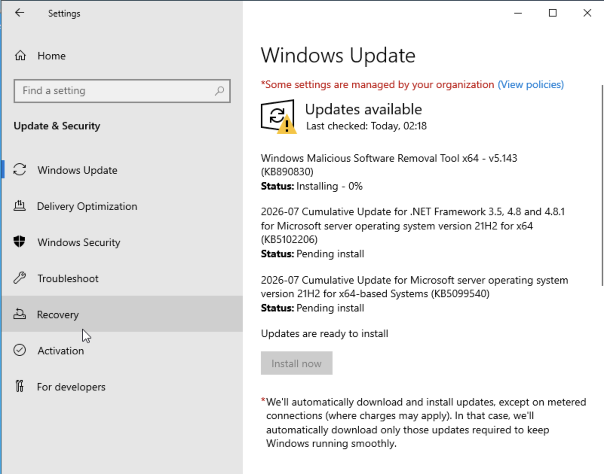 | 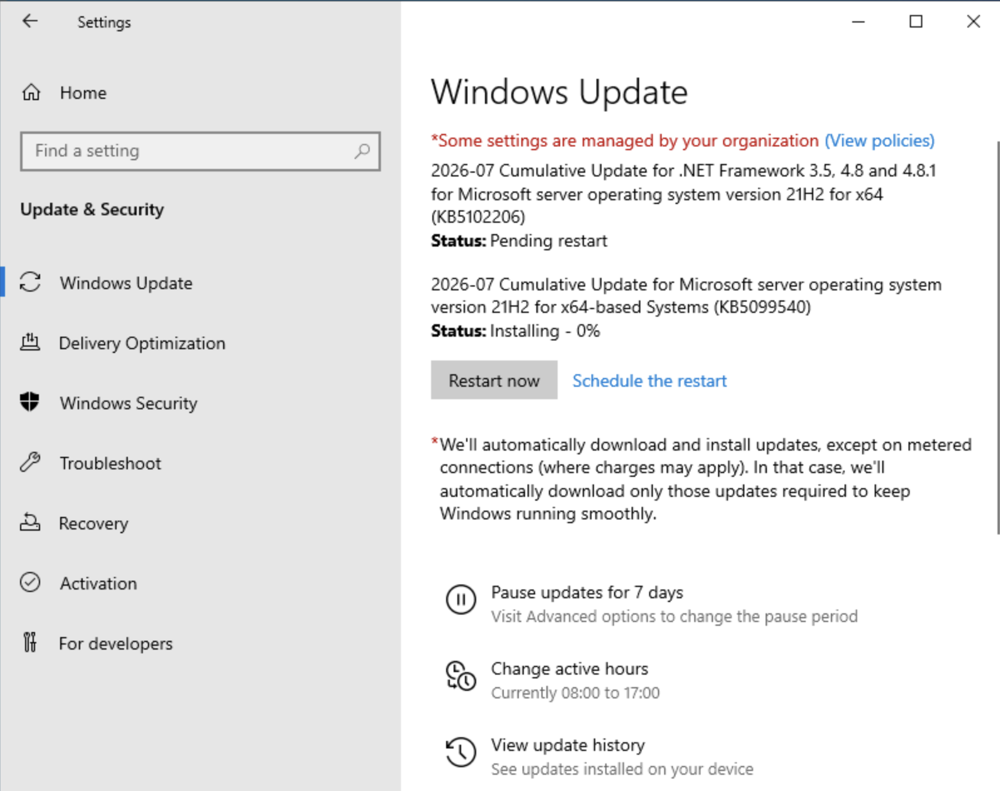 |

| Installing Updates | Updates Completed |
|:------------------:|:-----------------:|
| 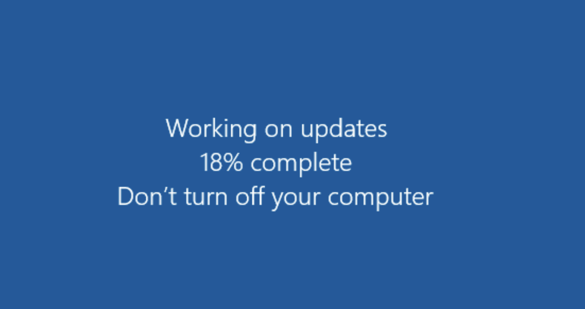 | 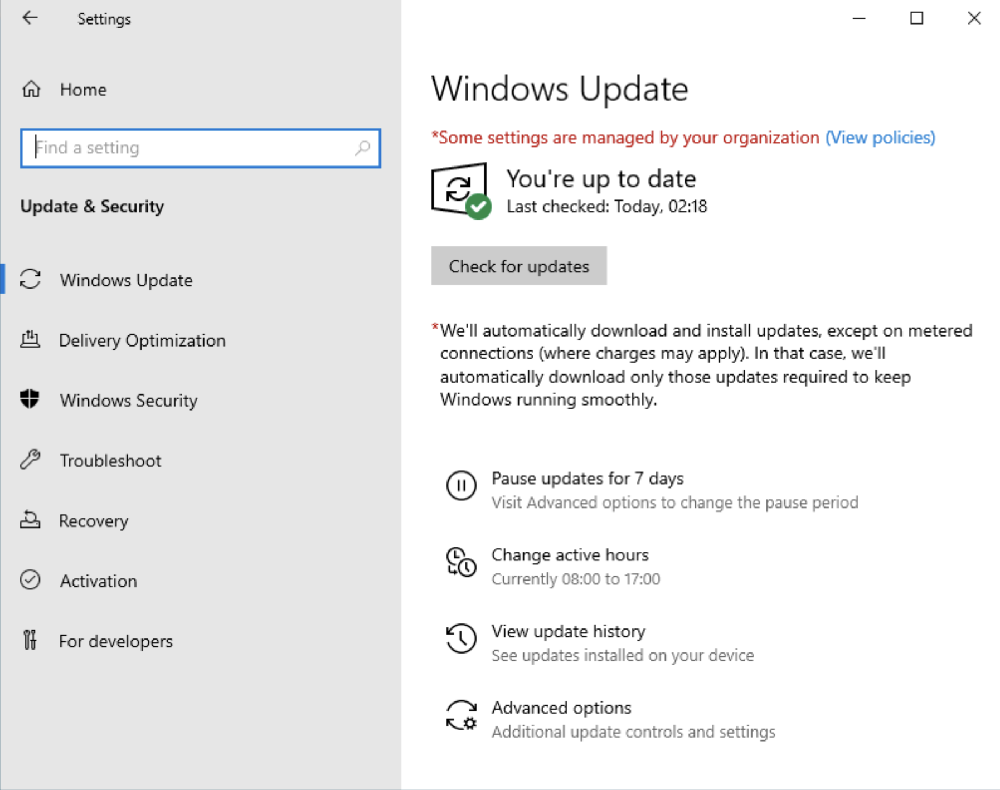 |

---

### 2. Rename the Server

By default, Windows generates a random computer name (for example, `WIN-XYZ123`). I renamed the server to **WIN-SRV01**.

Using a meaningful server name makes administration easier and follows common enterprise naming conventions. Changing the server name after promoting it to a domain controller is not recommended, so this step should be completed first.

| Rename Computer | Server Manager Verification |
|:---------------:|:---------------------------:|
| 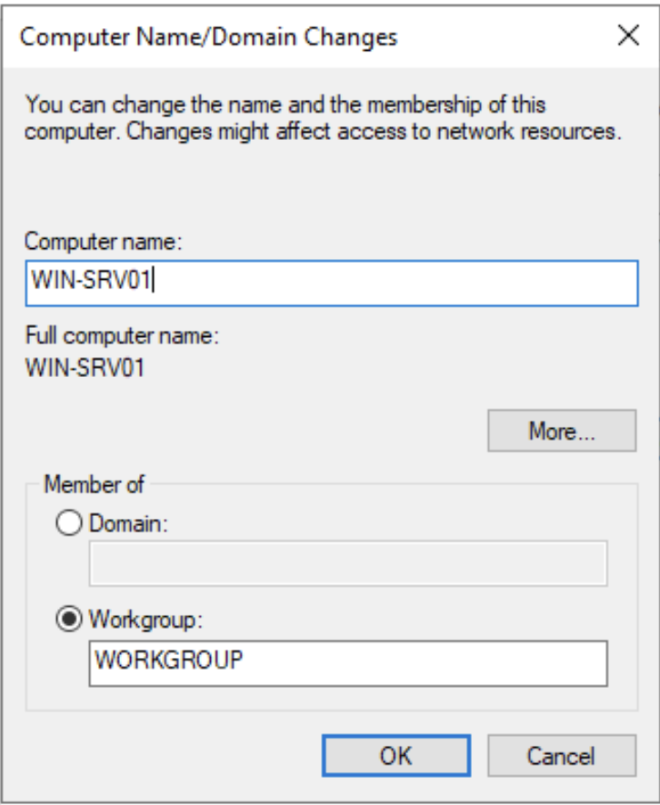 | 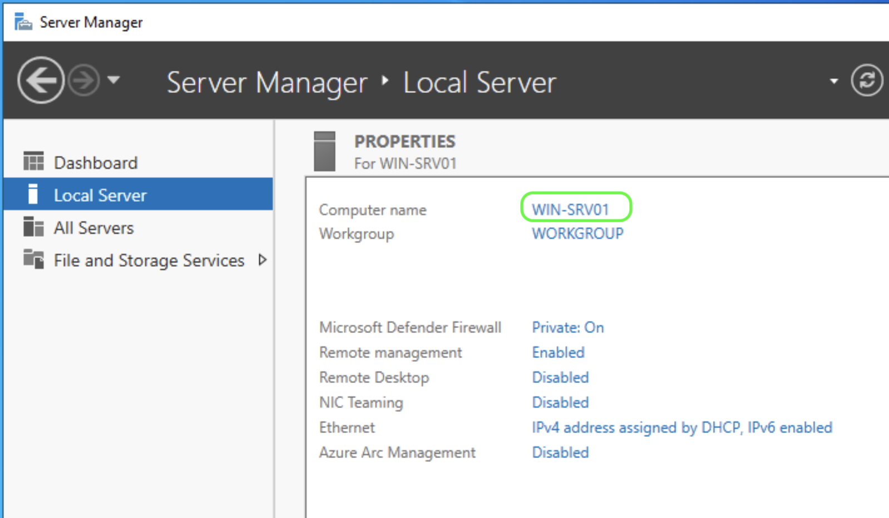 |

---

### 3. Configure a Static IP Address

I configured a static IPv4 address for the server.

Since this server will become the Active Directory Domain Controller and DNS Server, it must always use a fixed IP address to provide reliable network services.

> **Note**
>
> IP addresses and other network information have been partially hidden in the screenshots for security reasons.

| IPv4 Configuration | Network Verification |
|:------------------:|:--------------------:|
| 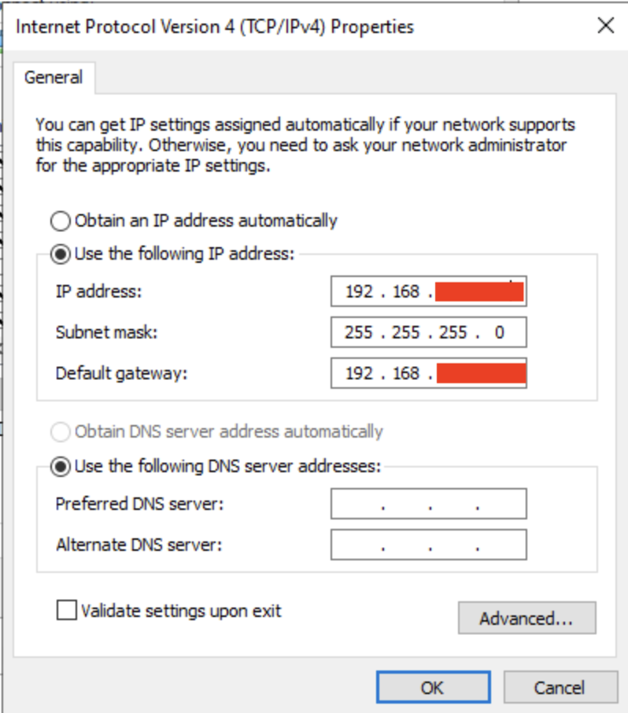 | 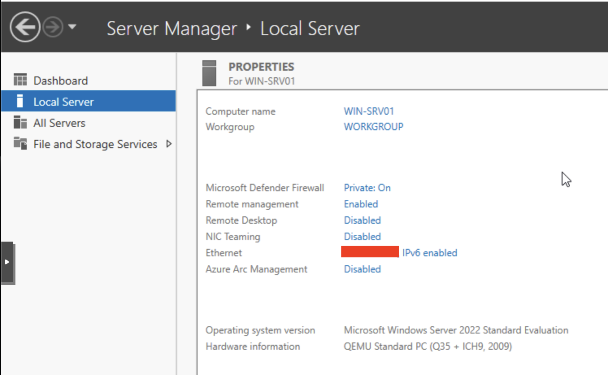 |

---

### 4. Enable Remote Desktop (RDP)

I enabled Remote Desktop with Network Level Authentication (NLA) to allow secure remote administration.

This allows me to manage the server from my main computer without using the Proxmox web console.

| Enable RDP | Local Server Overview |
|:----------:|:---------------------:|
| 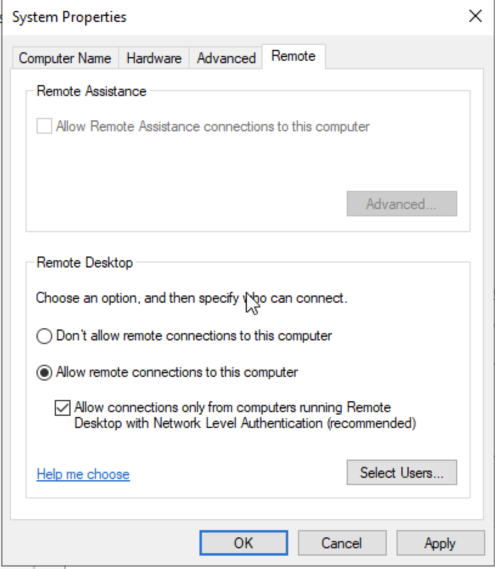 | 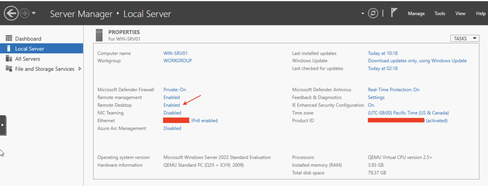 |

---

### 5. Configure Time Zone

I configured the correct local time zone for the server.

Accurate time settings are important because Active Directory relies on Kerberos authentication.

---

### 6. Verify Network Connectivity

Before continuing, I verified that the server networking was working correctly.

The following tests confirmed:

- Server hostname
- Internet connectivity
- DNS name resolution

| Network Connectivity Test |
|:-------------------------:|
| 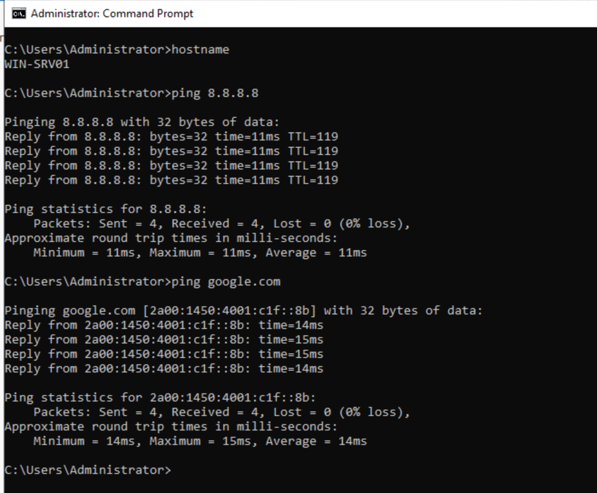 |

---

### 7. Create a Clean Snapshot

Finally, I created a clean snapshot of the virtual machine in Proxmox.

Installing Active Directory makes significant changes to Windows Server. Having a clean snapshot provides a reliable recovery point if I need to restore the server before the AD installation.

| Proxmox Snapshot |
|:----------------:|
| 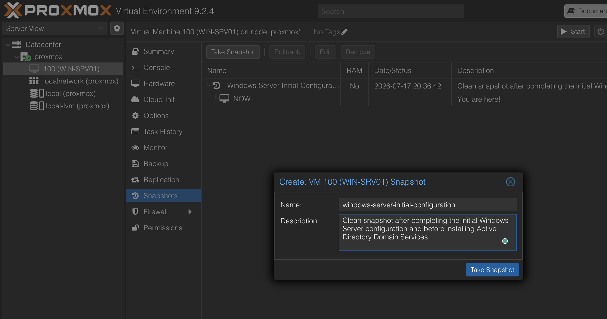 |

---

## Lessons Learned

- **Patch First:** Install Windows updates before configuring server roles.
- **Naming Convention:** Use a meaningful computer name before installing Active Directory.
- **Static IP:** Active Directory and DNS require a static IP address.
- **Time Synchronization:** Correct time settings are important for Kerberos authentication.
- **Backup Before Major Changes:** Create a snapshot before installing critical server roles.

---

## Next Step

The initial Windows Server configuration is now complete.

Continue with **Phase 6 – Active Directory Domain Services (AD DS)**.

The next phase covers:

- Installing the AD DS server role
- Promoting the server to a domain controller
- Creating a new Active Directory forest
- Verifying the Active Directory installation

---

## Navigation

| Previous | Home | Next |
|----------|------|------|
| ⬅️ [Windows Server Installation](../4-Windows-Server-Installation/README.md) | 🏠 [Home](../../README.md) | ➡️ [Active Directory Domain Services](../6-Active-Directory-DS/README.md) |
