# DNS & DHCP Configuration

> **Status:** ✅ Completed

---

## Project Overview

In this phase, I configured the Domain Name System (DNS) and the Dynamic Host Configuration Protocol (DHCP) for my HomeLab.

These two services are essential for any network. DNS translates computer names into IP addresses, while DHCP automatically assigns IP addresses and network settings to new devices.

---

# Part 1: DNS Configuration

When I promoted the server to a Domain Controller in the previous phase, the DNS Server role was installed automatically as part of the Active Directory Domain Services installation.

To check the configuration and manage my domain records, I opened the **DNS Manager** console from the Server Manager.

| DNS Manager Console |
|:-------------------:|
| 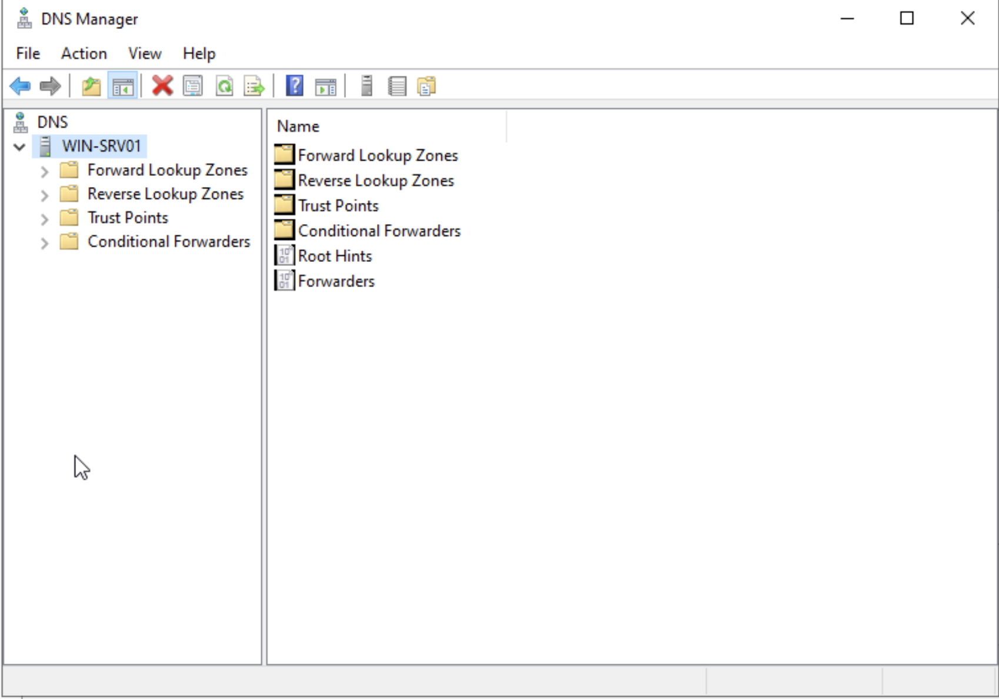 |

---

## Verifying the Forward Lookup Zones

I noticed that the Forward Lookup Zones were created automatically during the Active Directory setup.

- The `homelab.local` zone stores the DNS records for all computers and services in my domain.
- The `_msdcs` zone is used internally by Active Directory so domain computers can find the Domain Controller.

| Forward Lookup Zones | DNS Records in homelab.local |
|:--------------------:|:----------------------------:|
| 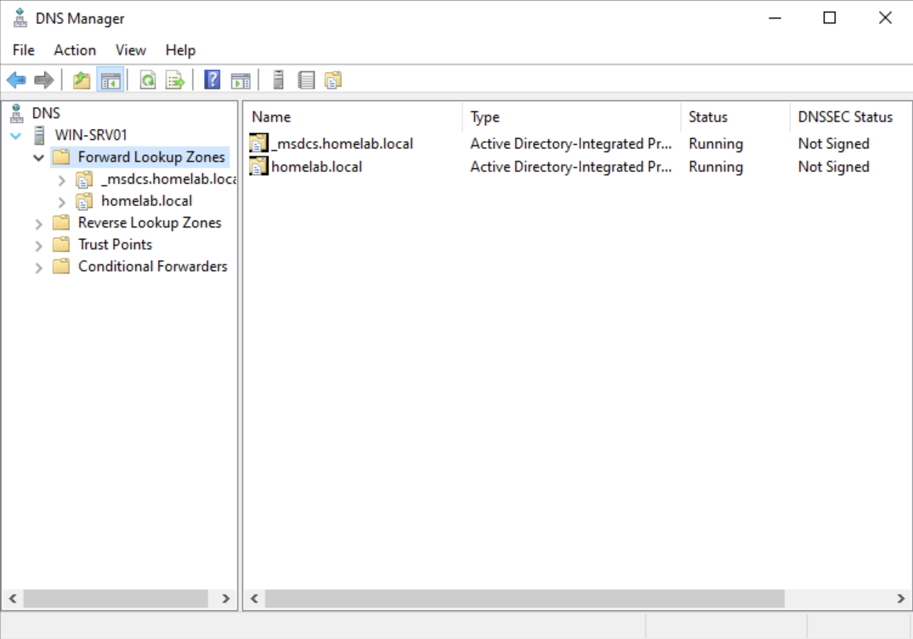 | 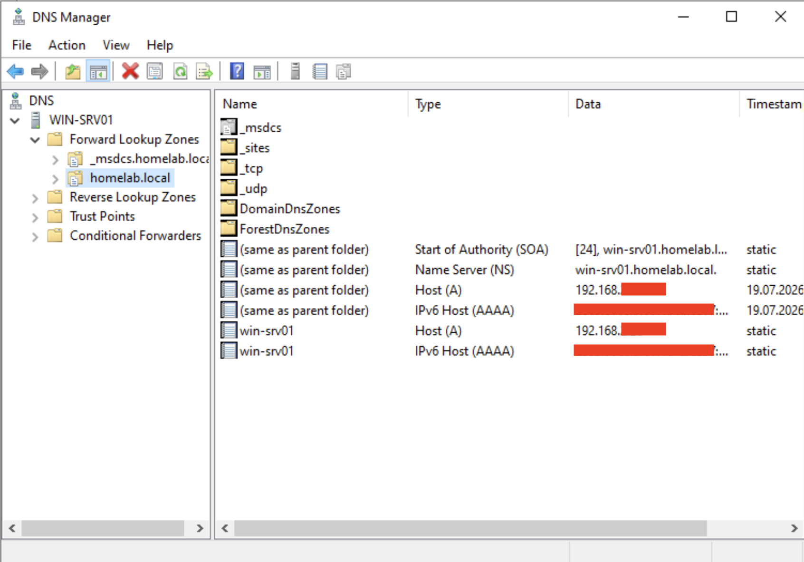 |

When I checked inside the `homelab.local` zone, I saw the required DNS records for my domain controller. This included the Host (A), Name Server (NS), and Start of Authority (SOA) records. These records allow other computers to locate the Domain Controller.

---

## Creating the Reverse Lookup Zone

While the Forward Lookup Zone translates names into IP addresses, the Reverse Lookup Zone does the opposite. It translates IP addresses back into hostnames.

Unlike the Forward Lookup Zone, the Reverse Lookup Zone was not created automatically during the Active Directory installation, so I created it manually.

I created a new Primary Zone for my local IPv4 network (`192.168.x.0/24`). This makes reverse DNS lookups available, which can be useful for troubleshooting and network administration.

| Creating a New Zone | Reverse Lookup Zone Created |
|:-------------------:|:---------------------------:|
| 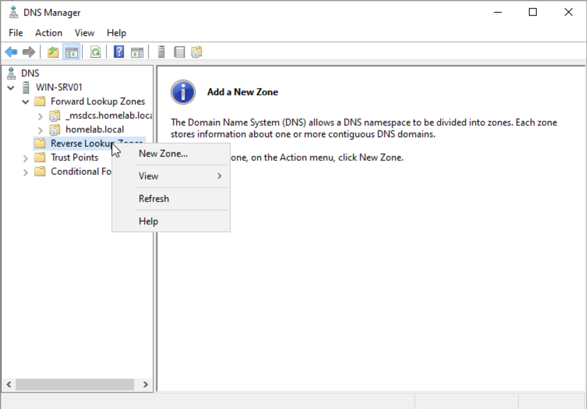 | 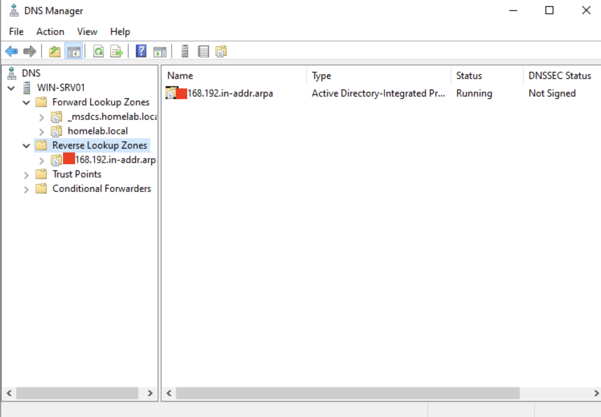 |

---

## Verifying DNS Resolution

After configuring the DNS zones, I wanted to make sure everything was working correctly.

I opened Command Prompt and used the `nslookup` command.

- First, I looked up the server name (`win-srv01`) and confirmed that it returned the correct IP address.
- Then, I looked up the server's IP address and confirmed that it returned the correct hostname.

| nslookup Command Test |
|:---------------------:|
| 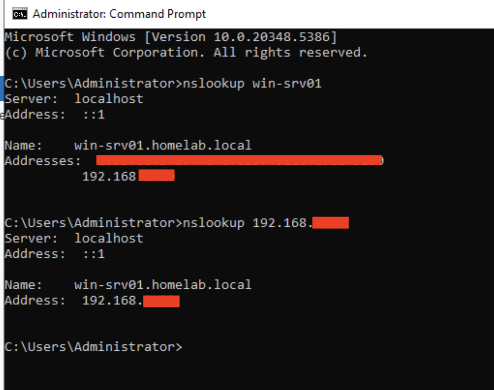 |

Both tests returned the expected results. This confirmed that both forward and reverse DNS resolution were working correctly.

---

# Part 2: DHCP Configuration

In a typical home network, the internet router (such as a FritzBox) assigns IP addresses to devices. For this HomeLab, I moved this task to Windows Server to better simulate a real business environment.

By using Windows Server as the DHCP server, every new computer automatically receives the correct DNS settings and can find the `homelab.local` domain without any manual configuration.

---

## Installing and Authorizing the DHCP Role

I installed the **DHCP Server** role using Server Manager.

After the installation, I completed the post-installation configuration. In an Active Directory environment, every DHCP server must be authorized before it can assign IP addresses. This helps prevent unauthorized DHCP servers from operating on the network.

I authorized the DHCP server using my `HOMELAB\Administrator` account.

| DHCP Post-Deployment | Authorizing DHCP Server |
|:--------------------:|:-----------------------:|
| 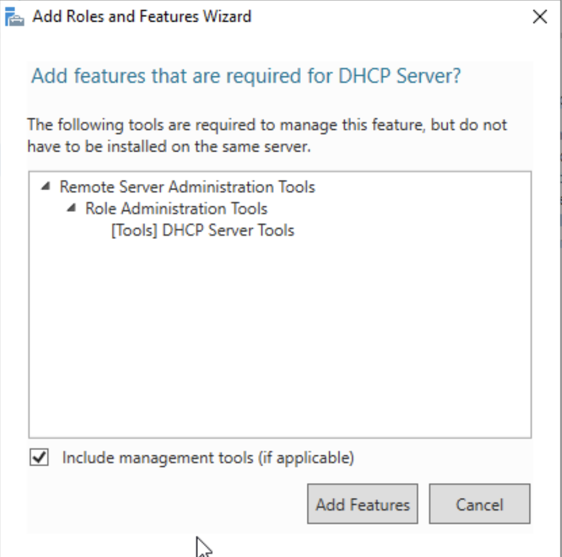 | 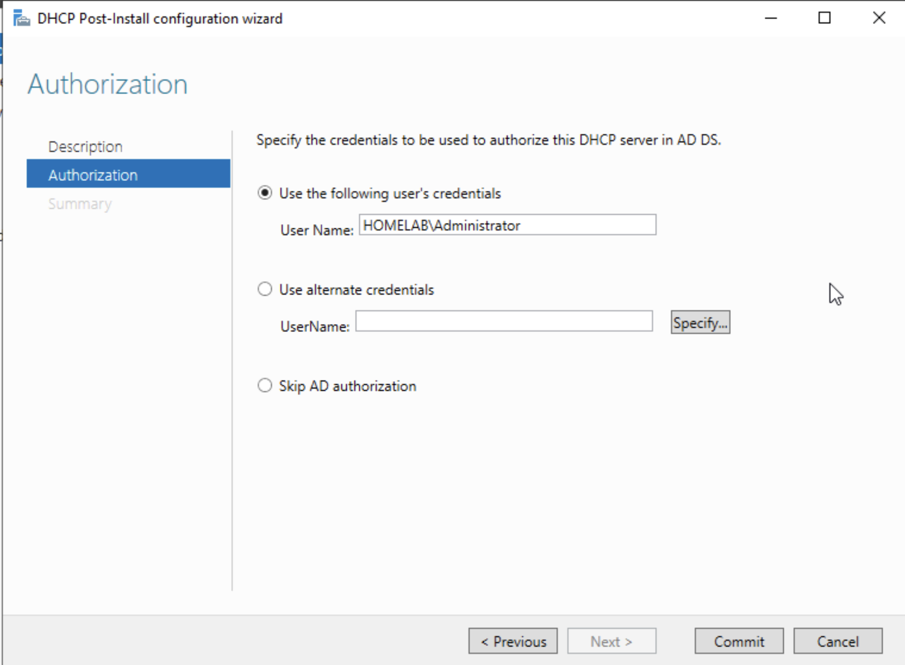 |

---

## Creating a New Scope

Next, I opened the **DHCP Manager** and created a new IPv4 Scope.

A scope is simply a pool of IP addresses that the DHCP server can assign to client computers.

When defining the address range, I intentionally left some IP addresses outside the DHCP pool. This allows me to use static IP addresses later for servers, printers, and other network devices.

| IP Address Range Configuration |
|:------------------------------:|
| 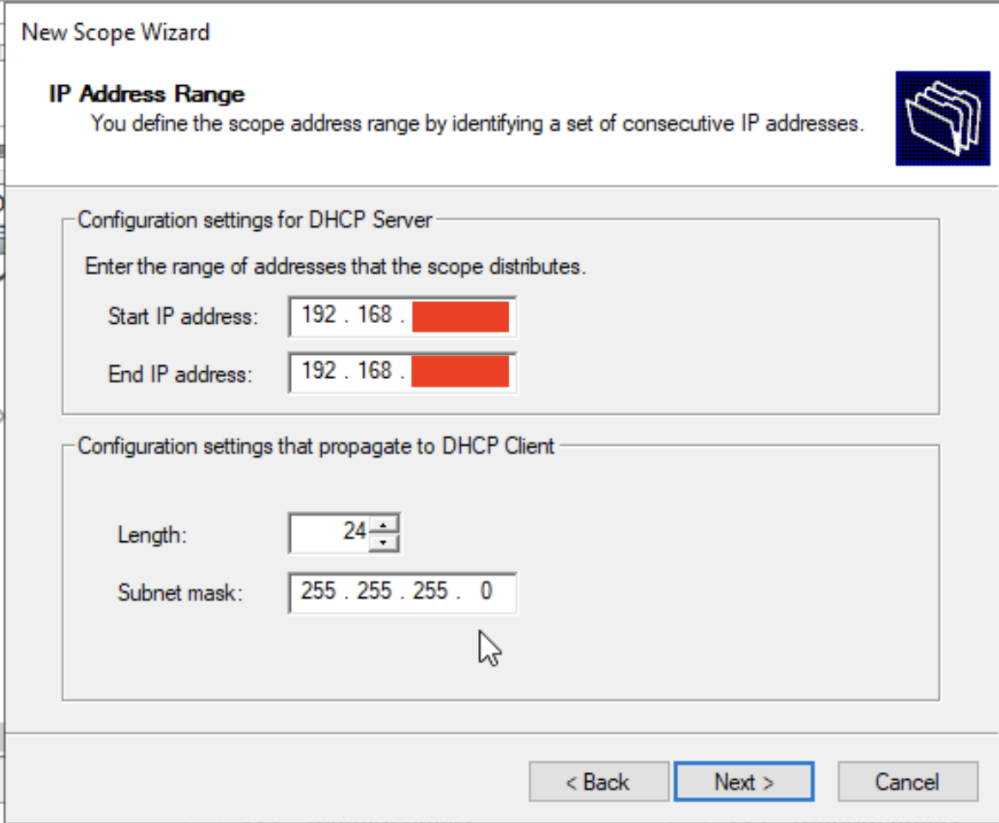 |

---

## Configuring DHCP Options

The final step was configuring the DHCP options for client computers.

I configured:

- **Default Gateway** – the IP address of my home router.
- **DNS Server** – the static IP address of my Domain Controller.
- **Parent Domain** – `homelab.local`.

With these settings, every client that receives an IP address from DHCP automatically knows how to reach the Domain Controller and join the domain.

| Configuring Default Gateway | Configuring DNS Options |
|:---------------------------:|:-----------------------:|
| 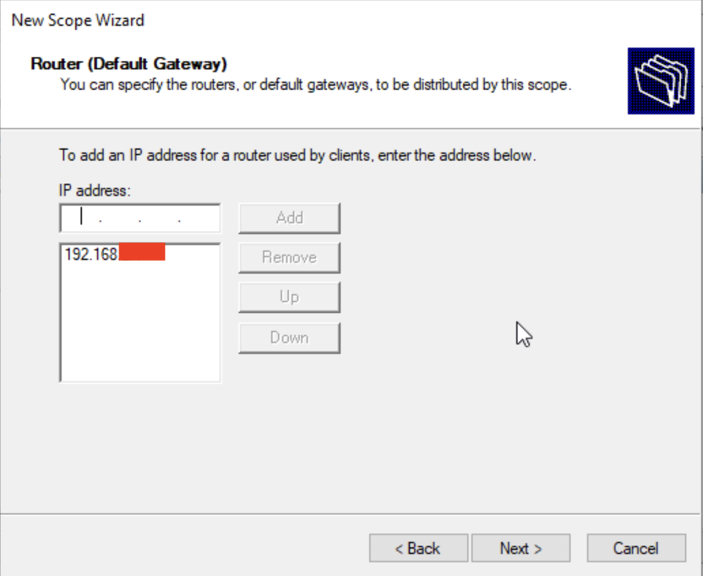 | 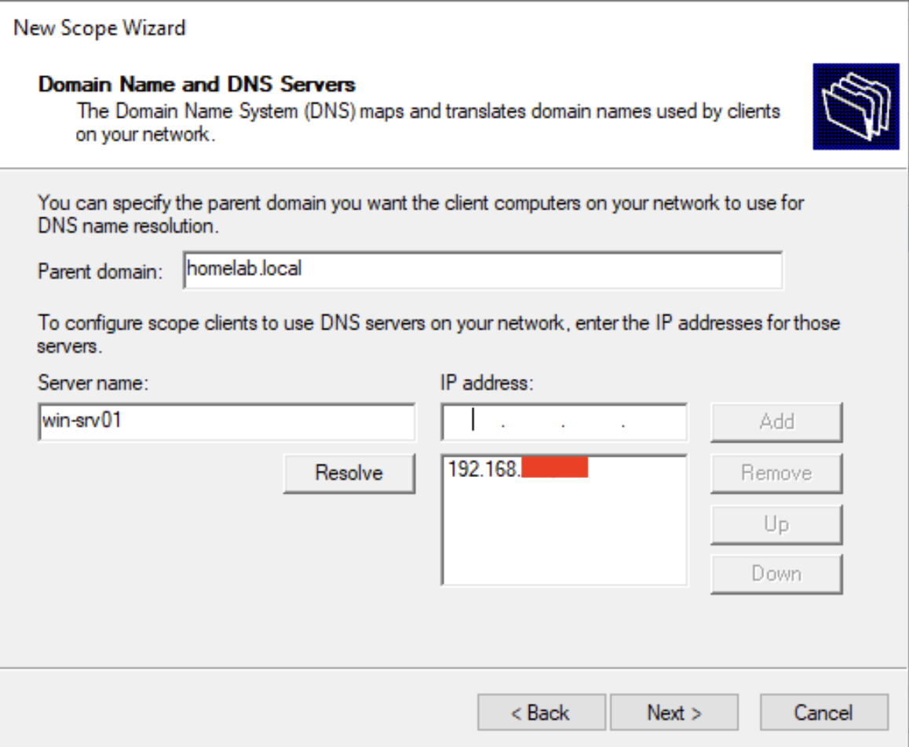 |

Finally, I activated the scope. The DHCP server is now ready to assign IP addresses to new virtual machines and client computers.

---

## Lessons Learned

- Active Directory automatically creates the Forward Lookup Zone, but the Reverse Lookup Zone must be created manually.
- The `nslookup` command is a quick and easy way to verify that DNS is working correctly.
- Using Windows Server as the DHCP server allows client computers to receive the correct DNS settings automatically.
- It is a good idea to leave part of the subnet outside the DHCP pool for devices that need static IP addresses.
- In an Active Directory environment, the DHCP server must be authorized before it can start assigning IP addresses.

---

## Next Step

With DNS and DHCP configured, the basic network infrastructure for the HomeLab is now complete.

In the next phase, I will create Organizational Units (OUs), user accounts, and Group Policy Objects (GPOs) to centrally manage the domain.

---

## Navigation

| Previous | Home | Next |
|----------|------|------|
| ⬅️ [Active Directory Domain Services](../6-Active-Directory-Domain-Services/README.md) | 🏠 [Home](../../README.md) | ➡️ [Group Policy & User Management](../8-Domain-Client&Group-Policy/README.md) | 
