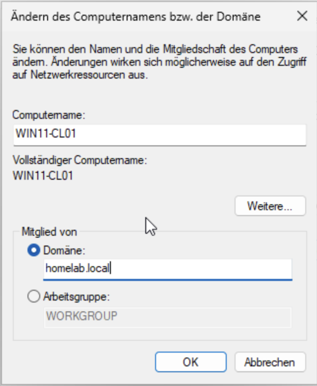
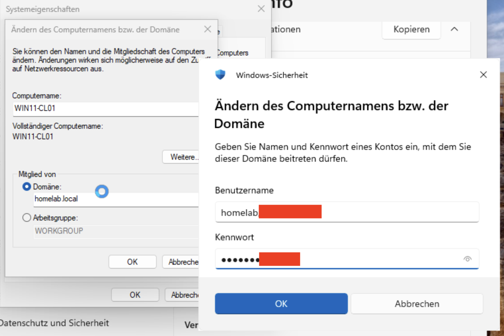
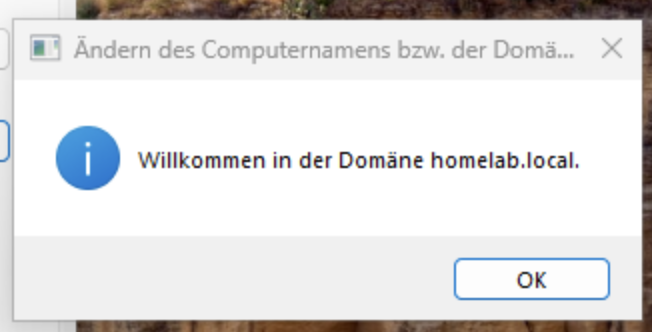
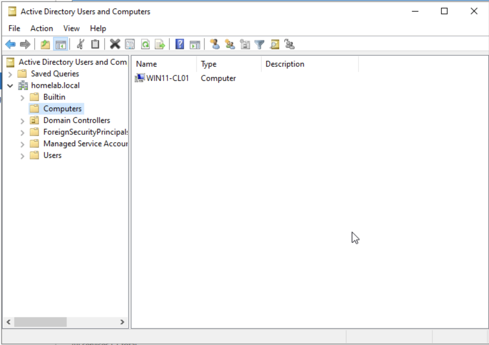
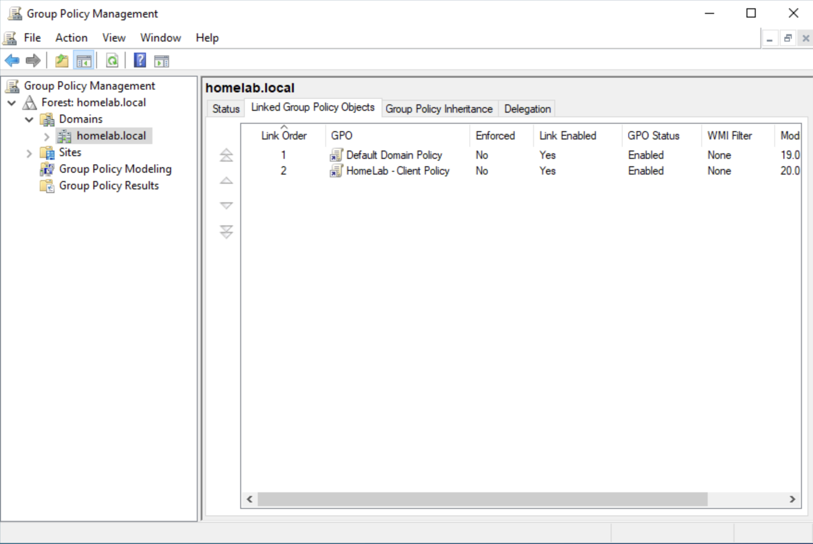
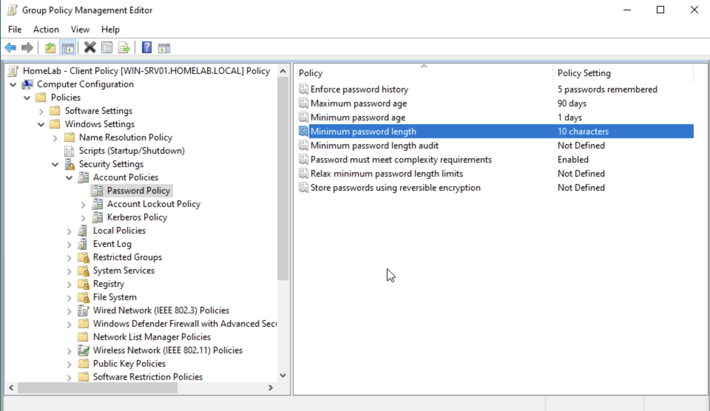
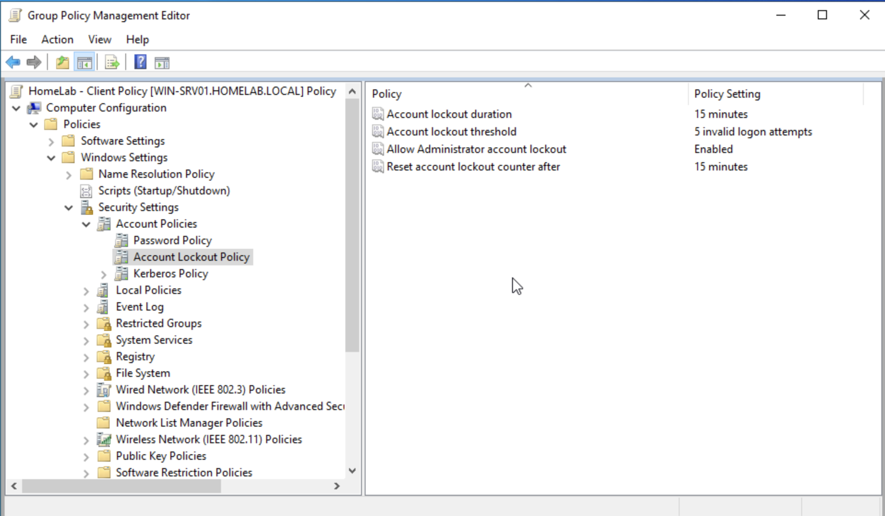
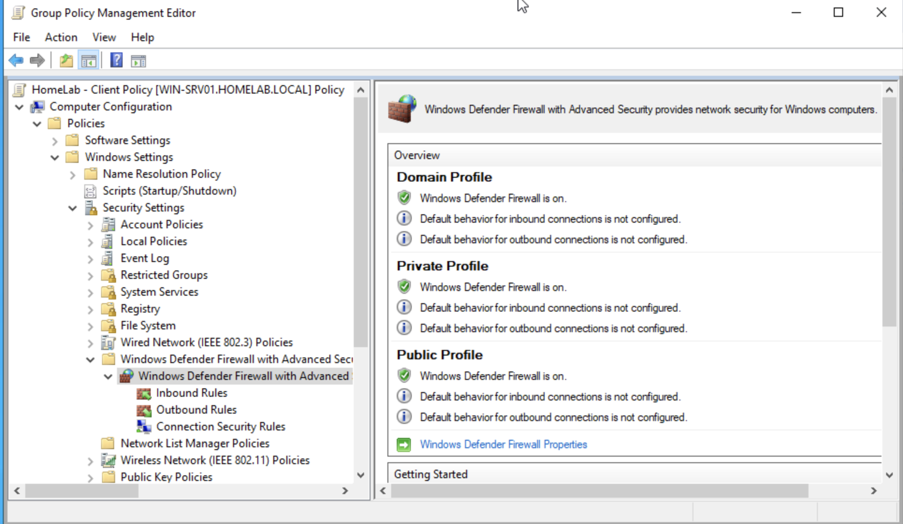
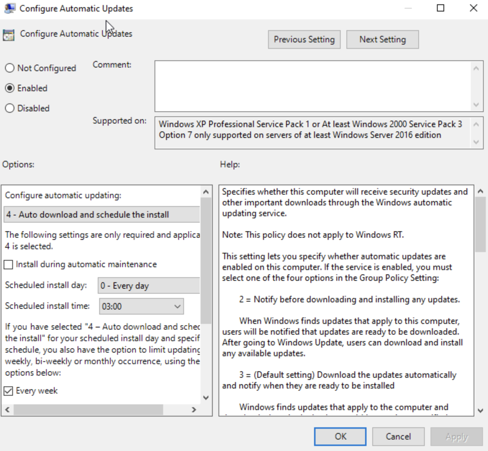

# Domain Client & Group Policy

> **Status:** ✅ Completed

---

## Overview

In this phase, I prepared a Windows 11 client computer for centralized management in my HomeLab environment.

First, I joined the Windows 11 client to the **homelab.local** domain and verified that it was successfully connected to Active Directory.

After the client was connected to the domain, I created and configured a custom Group Policy Object (GPO) with basic security settings such as password policies, account lockout, Windows Defender Firewall, and Windows Update.

---

## 1. Join the Windows 11 Client to the Domain

The first step was to join the Windows 11 client computer to the **homelab.local** domain. 

Before joining, I made sure the client received its IP address and DNS settings from the DHCP server running on my Windows Server. When prompted, I used my domain administrator credentials to authorize the process.

| Domain Join Settings | Credential Window | Welcome to the Domain |
|:--------------------:|:-----------------:|:---------------------:|
|  |  |  |

The client authenticated successfully with the domain controller and became part of the Active Directory environment.

---

## 2. Verify the Domain Join

After the Windows 11 client restarted, I verified the connection on the server.

I opened **Active Directory Users and Computers (ADUC)** and checked the `Computers` container. The Windows 11 client appeared in the Computers container. This confirmed that the computer joined the domain and was ready to receive Group Policy settings.

| Active Directory Verification |
|:-----------------------------:|
|  |

---

## 3. Create a Group Policy Object

With the client successfully joined, I opened the Group Policy Management Console to create a new policy.

Instead of modifying the Default Domain Policy, I created a separate policy called **HomeLab - Client Policy**. Creating separate policies makes management easier, reduces risks, and follows common best practices.

| Group Policy Management | 
|:-----------------------:|
|  | 

---

## 4. Configure Password Policy

To improve account security in the domain, I configured a basic password policy.

This policy requires stronger passwords by enforcing a minimum password length, keeps a password history, and defines how often users must change their passwords.

| Password Policy |
|:---------------:|
|  |

---

## 5. Configure Account Lockout Policy

To help protect the environment against repeated sign-in attempts, I configured an account lockout policy.

After five failed logon attempts, the account is temporarily locked for 15 minutes. This helps reduce the risk of password guessing (brute-force) attacks.

| Account Lockout Policy |
|:----------------------:|
|  |

---

## 6. Configure Windows Defender Firewall

Windows Defender Firewall was managed through Group Policy.

Keeping the firewall enabled on all domain computers on all domain computers provides an additional layer of protection and ensures consistent security settings across the environment.

| Windows Defender Firewall Policy |
|:--------------------------------:|
|  |

---

## 7. Configure Windows Update

Finally, I configured automatic Windows Updates through Group Policy.

This allows client computers to download and install updates automatically according to the configured schedule, making it easier to keep systems secure and up to date.

| Windows Update Policy |
|:---------------------:|
|  |

---

## Lessons Learned

- **DNS/IPv6 Conflict:** My Windows 11 client VM was receiving IPv6 configuration from both the HomeLab environment and my physical home router. This caused problems when joining the domain. After troubleshooting the issue, I disabled IPv6 on the client network adapter so it no longer used the home router's IPv6 configuration. The client then joined the domain successfully.
- **Best Practice:** Creating a separate Group Policy Object instead of modifying the Default Domain Policy makes the environment easier to manage and troubleshoot.
- **Testing:** Testing Group Policy with a real domain-joined client helped me better understand how policies are applied and managed centrally from the domain controller.

---

## Summary

In this phase, I joined a Windows 11 client to the domain and successfully integrated it into the Active Directory environment. 

Then, I created and configured a custom Group Policy Object for my HomeLab. The policy includes password requirements, account lockout settings, Windows Defender Firewall, and Windows Update configuration. The Windows 11 client is now part of the Active Directory environment and can be managed centrally through Group Policy.

---

## Navigation

| Previous | Home | Next |
|----------|------|------|
| ⬅️ [DNS & DHCP Configuration](../7-DNS-DHCP/README.md) | 🏠 [Home](../../README.md) | ➡️ [File Server & NTFS Permissions](../9-Active-Directory-Organization&Security-File-Sharing/README.md) |
