# 9 – Active Directory Organization & Secure File Sharing

> **Status:** ✅ Completed

---

## Overview

In this phase, I organized my Active Directory environment and created a secure file-sharing system for different departments.

Instead of keeping all users and computers in the default folders, I created a clean Organizational Unit (OU) structure. I also created department user accounts and security groups for Finance, HR, IT, and Management.

To follow Microsoft's recommended best practices, I applied **Role-Based Access Control (RBAC)**. Instead of assigning folder permissions directly to individual users, I assigned permissions to Security Groups and added the users to those groups. This makes permission management much easier and more secure.

Finally, I tested the configuration from my Windows 11 client to verify that users could only access their own department's shared folders.

---

## 1. Verify the File Server Role

Before creating any shared folders, I checked Server Manager to verify that the **File Server** role was installed. It is usually installed by default alongside other core storage services, but verifying it first is a good practice.

| File Server Role Verification |
|:-----------------------------:|
| 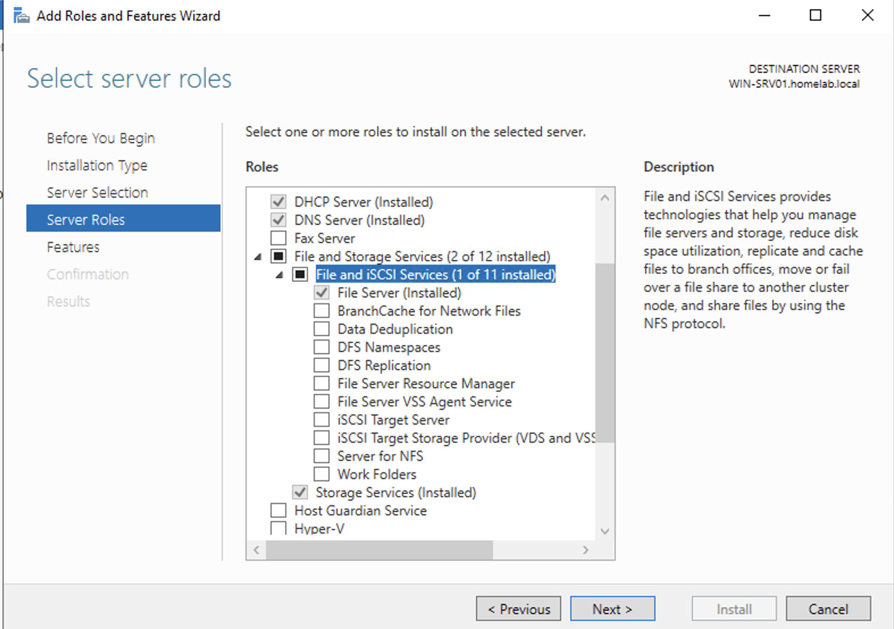 |

---

## 2. Create the Shared Folder Structure

I created a central folder named **FileShares** on the server and organized separate folders for each department.

```text
C:\FileShares
│
├── Departments
│   ├── Finance
│   ├── HR
│   ├── IT
│   └── Management
│
└── Public
```

| Folder Structure |
|:----------------:|
| 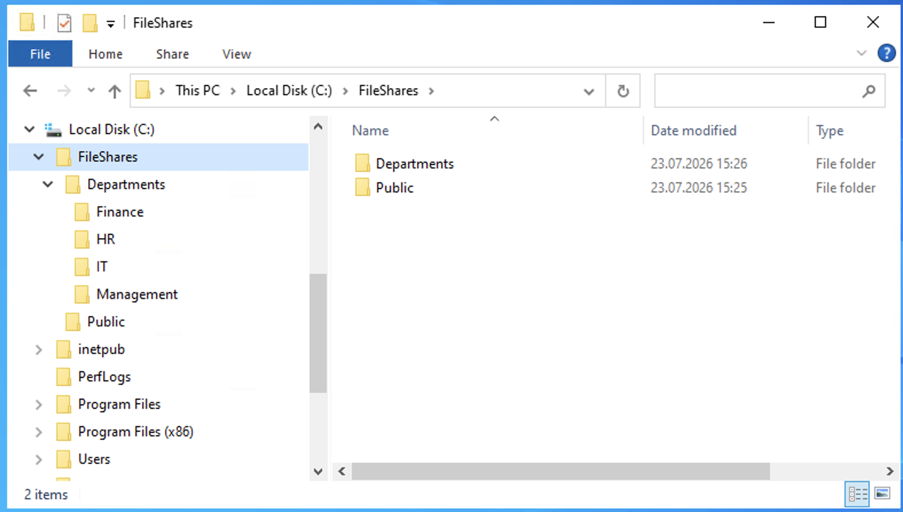 |

---

## 3. Organize Active Directory (OUs)

To keep the Active Directory environment clean and easy to manage, I created a structured Organizational Unit (OU) hierarchy.

I created dedicated OUs for users, groups, servers, and workstations. Under **CorpUsers**, I created separate OUs for each department.

| Active Directory OU Structure |
|:-----------------------------:|
| 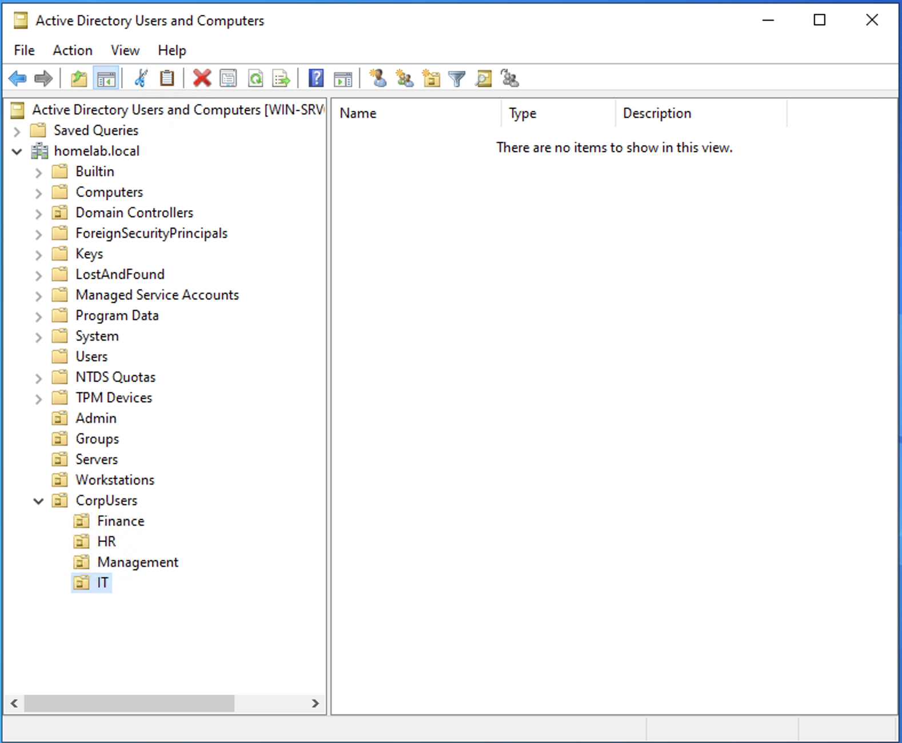 |

---

## 4. Create Department User Accounts

Next, I created user accounts for each department (Finance, HR, IT, and Management) and placed every user inside its corresponding department OU.

| Create User Wizard | Password Configuration |
|:------------------:|:----------------------:|
| 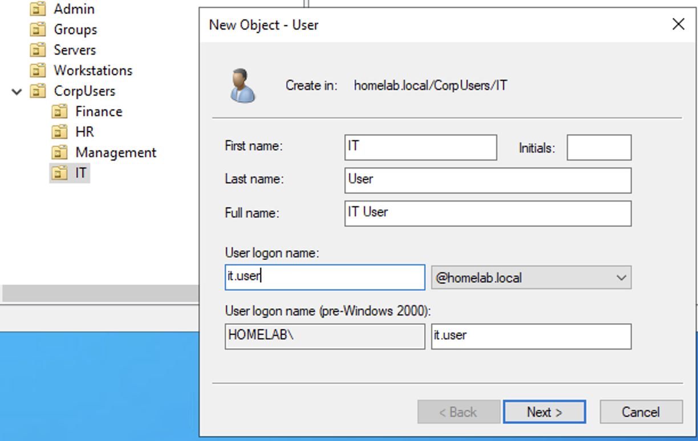 | 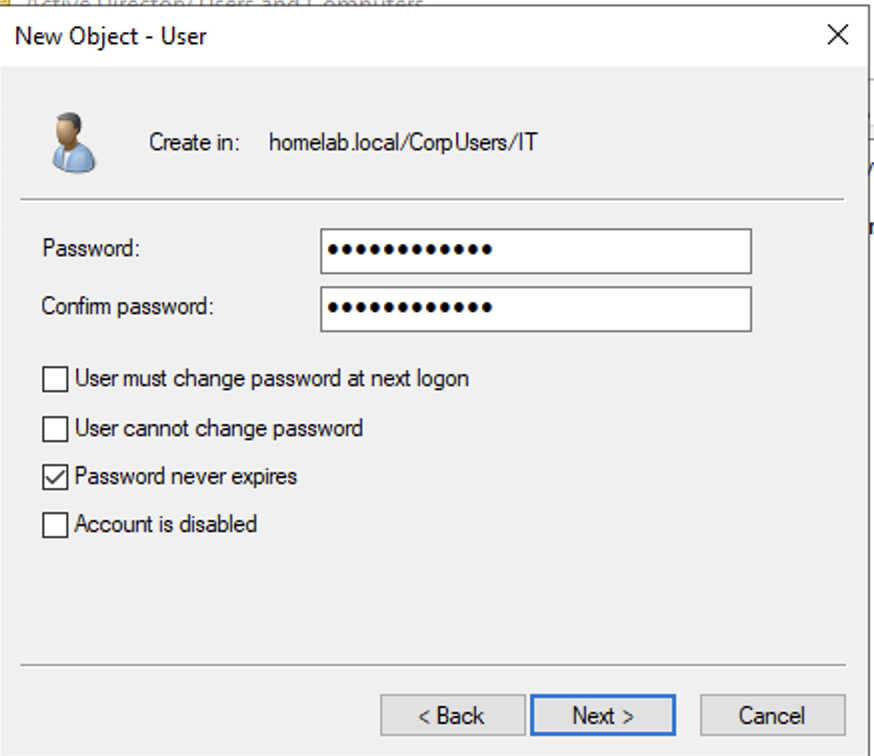 |

| IT User Created | Finance User Created |
|:---------------:|:--------------------:|
| 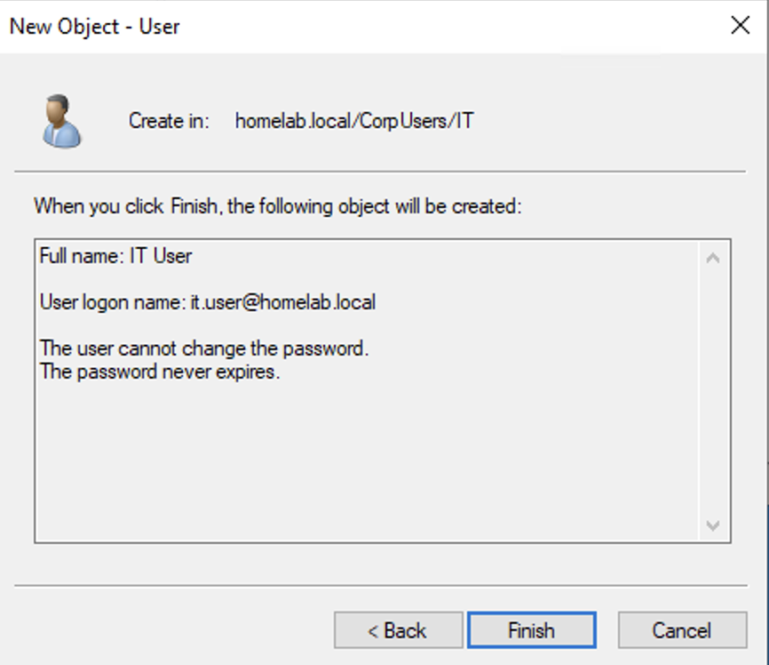 | 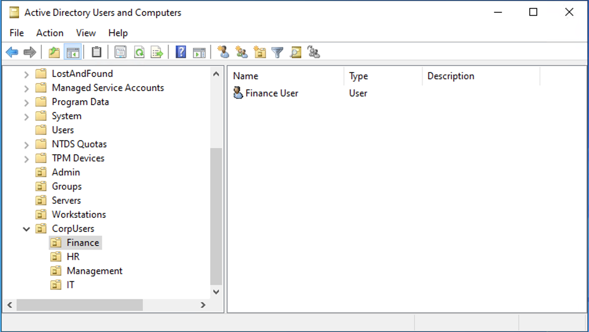 |

---

## 5. Create Security Groups

Instead of assigning permissions directly to users, I created **Global Security Groups** for each department.

The following groups were created:

- GG_FINANCE
- GG_HR
- GG_IT
- GG_MANAGEMENT
- GG_MANAGERS

| Create Security Group | Security Groups |
|:---------------------:|:---------------:|
| 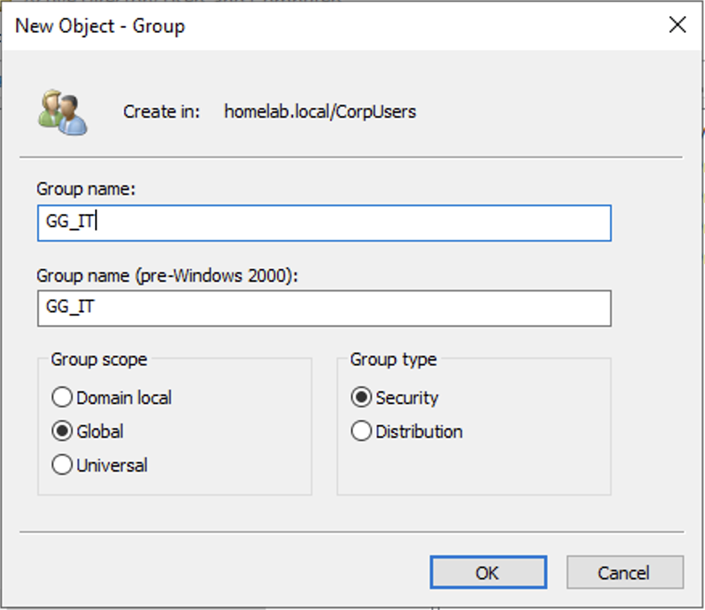 | 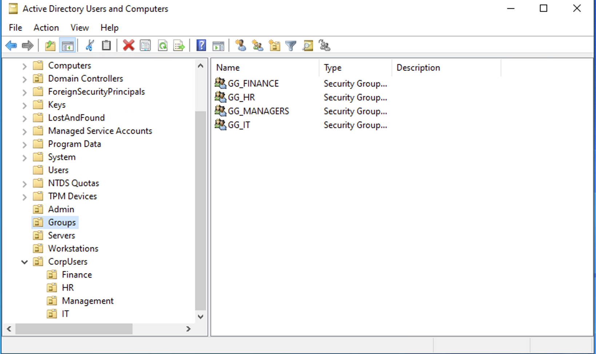 |

---

## 6. Assign Users to Security Groups

I assigned each user to the appropriate Security Group using the **Member Of** tab.

For example:

- Finance User → GG_FINANCE
- HR User → GG_HR
- IT User → GG_IT
- Manager User → GG_MANAGEMENT + GG_MANAGERS

This approach follows Microsoft's Role-Based Access Control (RBAC) model and makes permission management much easier.

| User Group Membership |
|:---------------------:|
| 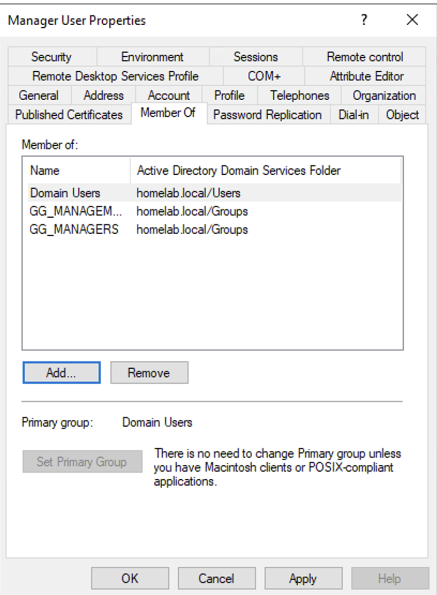 |

---

## 7. Configure NTFS Permissions

For each departmental folder, I configured NTFS permissions instead of assigning permissions directly to users.

First, I disabled inherited permissions to remove the default permissions inherited from the C: drive.

Then I configured explicit permissions:

- **SYSTEM** → Full Control
- **Administrators** → Full Control
- **Department Security Group** → Modify

For example, the Finance folder uses the following configuration:

| Finance NTFS Permissions |
|:------------------------:|
| 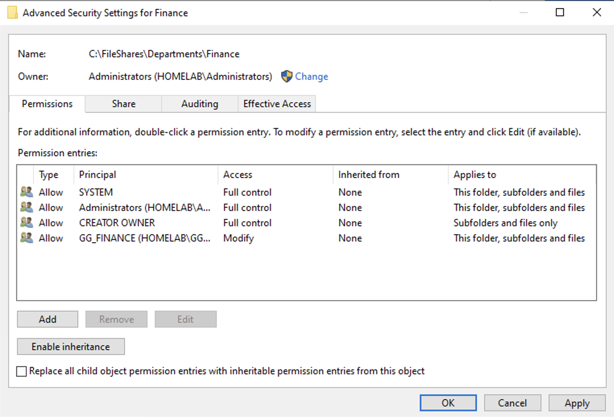 |

By assigning **Modify** permission to **GG_FINANCE**, every member of that group automatically receives the correct access permissions.

---

## 8. Test File Access

To verify that the permissions were working correctly, I logged in to the Windows 11 client as **Finance User**.

The user successfully accessed the Finance shared folder and created a test file.

When the same user attempted to open the HR shared folder, Windows correctly denied access because the user is not a member of the **GG_HR** Security Group.

The same validation was also performed successfully for the HR, IT, and Management users.

| Shared Folders | Finance Access | HR Access Denied |
|:--------------:|:--------------:|:----------------:|
| 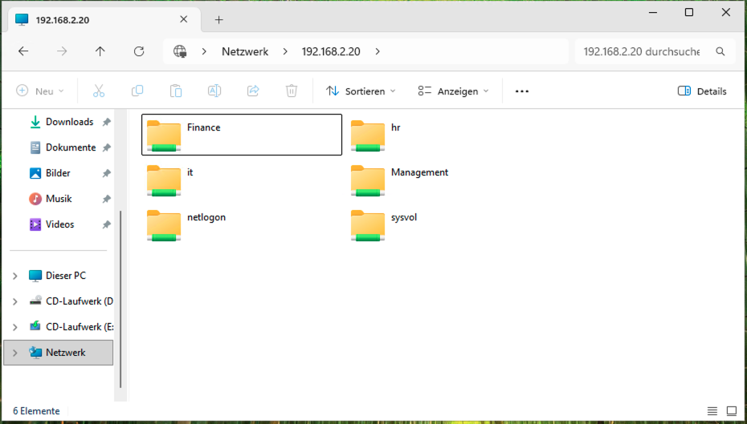 | 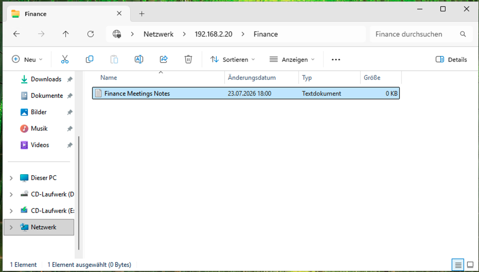 | 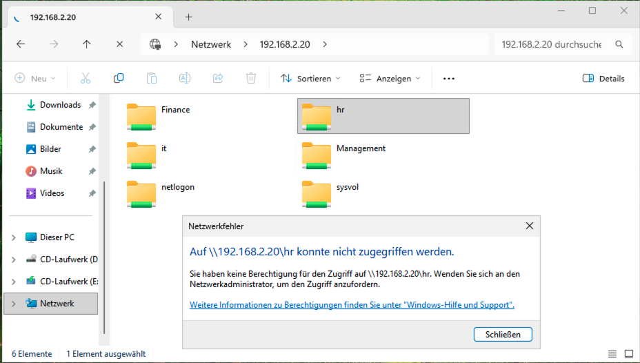 |

---

## Lessons Learned

- Following Microsoft's **Role-Based Access Control (RBAC)** model makes permission management much easier.
- Assigning permissions to Security Groups instead of individual users simplifies future administration.
- Separating users into Organizational Units (OUs) keeps Active Directory organized and easier to manage.
- NTFS permissions provide secure access control at the file system level.
- Testing with standard user accounts is the best way to verify that permissions are configured correctly.

---

## Navigation

| Previous | Home | Next |
|:--------:|:----:|:----:|
| ⬅️ [ Group Policy & Domain Join](../8-Domain-Client&Group-Policy/README.md) | 🏠 [Home](../../README.md) | ➡️ Phase 10 – Print Server Configuration *(Coming Soon)* |
